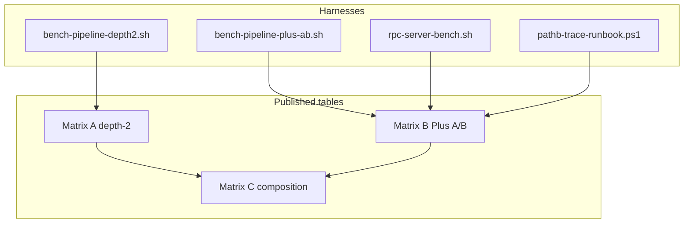

# Benchmarking and profiling -- Path-B Plus pipeline layers

> Scope: **Path-B-Event-Support-Pipeline-Plus** branch. This document defines how
> to measure the **shipped** pipeline layers documented in [PIPELINE.md](PIPELINE.md):
>
> - **Layer A (depth-2)** -- speculative draft overlap (`LLAMA_PIPELINE_DEPTH2`)
> - **Layer B (Path-B Plus)** -- multi-GPU graph-split overlap (`GGML_PIPELINE_PLUS`)
>
> It does **not** cover unshipped application event injection (sensor feeds, API
> callbacks mid-generation). Mother-branch MTP/NextN/TurboQuant matrices remain in
> [MTP.md](MTP.md) and [NEXTN.md](NEXTN.md); this doc isolates **Plus-specific**
> A/B value on top of those wins.

See also [benches/path-b-plus/](benches/path-b-plus/), [docs/llama-pipeline-profiler/OVERVIEW.md](docs/llama-pipeline-profiler/OVERVIEW.md), [rpc-patch/docs/rpc-path-b-plus-spikes.md](rpc-patch/docs/rpc-path-b-plus-spikes.md), [docs/cuda-windows-5070ti/PROFILING.md](docs/cuda-windows-5070ti/PROFILING.md).

---

## 1. Why this doc exists

Gemma/Qwen matrices prove speculative + TurboQuant throughput on single-node Metal.
Multi-GPU Path-B Plus adds a second overlap axis (scheduler splits, RPC events)
that was validated in spike runs and cluster gates but not published in a single
root-level reference with standard A/B presets.

**Goal:** reproducible workflow + tables that answer:

1. How much does **depth-2** add on top of async MTP/NextN?
2. How much does **Path-B Plus** add vs legacy full-sync on graph reuse?
3. Does overlap survive real topologies (2-GPU F, 4-GPU G)?
4. How do we **profile** stragglers and false-low GPU util?

---

## 2. Bench taxonomy

| Tier | Question | Primary metrics | Default harness |
|------|----------|-----------------|-----------------|
| **T0** Speculative | Does depth-2 help? | Median G t/s, accept % | [scripts/bench-pipeline-depth2.sh](scripts/bench-pipeline-depth2.sh) |
| **T1** Scheduler | Does Plus unblock splits? | G t/s, `assembly_overlap_count`, ms/tok per backend | [scripts/bench-pipeline-plus-ab.sh](scripts/bench-pipeline-plus-ab.sh) + [llama-pipeline-profiler](tools/llama-pipeline-profiler/README.md) |
| **T2** Server load | Overlap under concurrency? | Aggregated tps, TTFT p50/p99 | [scripts/bench-parallel.sh](scripts/bench-parallel.sh) (extend later) |
| **T3** Composition | Full stack credible? | Matrix: spec x turbo x plus x topology | [benches/path-b-plus/composition/](benches/path-b-plus/composition/) |



---

## 3. Standard run contract

Match existing fork harnesses so numbers are comparable across docs.

### Server settings (invariant)

| Setting | Value | Notes |
|---------|-------|-------|
| Slots | `-np 1`, `--parallel 1` | Large-model default in `rpc-server-bench.sh` |
| Cont batching | on (server default) | |
| Client | `/v1/chat/completions` | `temperature=0`, `cache_prompt=false`, `stream=false` |
| Runs per cell | 3 | Report **median** G t/s |
| Default prompt | fox (rpc bench) or 300-word essay (qwen matrix) | Label which in summary |

### Trace settings (optional)

| Env | Effect |
|-----|--------|
| `BENCH_TRACE=1` | Enables `GGML_SCHED_TRACE` + `GGML_RPC_TRACE` + `GGML_PIPELINE_TRACE` under `telemetry/` |
| `GGML_PIPELINE_PLUS` | `1` (default when tracing) or `0` for A/B |
| `LLAMA_MTP_ACC_TRACE` | Layer A acceptance NDJSON ([PIPELINE.md](PIPELINE.md) S6) |

### Host metadata (required for every published row)

| Field | Example |
|-------|---------|
| Machine | MacBook Pro M4 Max / Windows 5070 Ti + remus 5060 |
| Backend | Metal / CUDA+ROCm client |
| Git sha | `git rev-parse --short HEAD` |
| Model + quant | `Qwen3.6-35B-A3B-UD-IQ4_NL_XL.gguf` |
| ctx | 4096 / 8192 |
| KV | `q4_0`, `turbo3`, `q8_0` |
| Topology | `--rpc` endpoints, `-ts` split |
| Layer knobs | `LLAMA_PIPELINE_DEPTH2`, `GGML_PIPELINE_PLUS` |

---

## 4. Matrix A -- depth-2 (Layer A, single-node)

Compare **unset** (depth-2 on) vs `LLAMA_PIPELINE_DEPTH2=0` on the **same**
running `llama-server` with MTP or NextN enabled.

| Cell | depth-2 | Spec | KV | Host | short G (n=128) | Status |
|------|---------|------|-----|------|-----------------|--------|
| gemma-26B turbo3-mtp | on | mtp | turbo3 | M4 Max | 80.5 | [MTP.md](MTP.md) matrix |
| gemma-26B turbo3-mtp | off | mtp | turbo3 | TBD | TBD | run T0 stub |
| qwen-35B turbo3-nextn | on | nextn | turbo3 | M4 Max | 82.7 | [NEXTN.md](NEXTN.md) |
| qwen-35B turbo3-nextn | off | nextn | turbo3 | TBD | TBD | run T0 stub |

**Decision gate** (from [docs/development/pipeline-depth-2-pure-overlap.md](docs/development/pipeline-depth-2-pure-overlap.md)): >= **+15%** median tps vs depth-2 off on f16-mtp short prompt (3 runs).

### Run

```bash
# Prerequisites: llama-server with --spec-type mtp or nextn already on HOST:PORT
HOST=127.0.0.1 PORT=8080 N_PREDICT=128 RUNS=3 \
  ./scripts/bench-pipeline-depth2.sh

# Optional: capture acceptance path distribution
LLAMA_MTP_ACC_TRACE=/tmp/mtp-depth2.ndjson ./scripts/bench-pipeline-depth2.sh
```

Artifacts: [benches/path-b-plus/depth-2/](benches/path-b-plus/depth-2/).

---

## 5. Matrix B -- Path-B Plus (Layer B, multi-GPU)

Compare `GGML_PIPELINE_PLUS=1` vs `0` at fixed topology. Published rows (imported):

| Label | Plus | Topology | ts | G (t/s) | overlap_count | Source |
|-------|------|----------|-----|---------|---------------|--------|
| trace-f-3gpu-legacy | 0 | 5070+5060+6600 | 30,12,58 | 39.3 | 127 | [spikes](rpc-patch/docs/rpc-path-b-plus-spikes.md) |
| trace-f-3gpu-plus | 1 | 5070+5060+6600 | 30,12,58 | 42.8 | 289 | spikes S5 |
| trace-f-2gpu-plus | 1 | 5070+5060 | 50,50 | **48.9** | 267 | **production default** |
| trace-g-4gpu-primary | 1 | 7900+3060+5060+5070 | 36,24,24,16 | 38-43 | 1075 | [cluster summary](rpc-patch/patch/bench-results/cluster-4gpu-primary/summary.md) |

Hotpath (4-GPU trace): serial **20.7 ms/tok**; 5060 straggler **9.6 ms/tok**.

### Pass/fail gates (from spikes)

| Spike | Criterion |
|-------|-----------|
| S4 | No corruption; pipeline + sched copies=4 |
| S5 | `assembly_overlap_count > 0` during GEN |
| S1 | COPY budget documented |
| S3 | `drain_flush_ms` down vs legacy (2523 -> 1734 on 2gpu-plus) |

### Run (Linux / romulus client)

```bash
export BENCH_MODEL=/mnt/models/Qwen3.6-35B-A3B-UD-IQ4_NL_XL.gguf
export BENCH_RPC_ENDPOINT=192.168.8.176:50051
export BENCH_TS=50,50
export BENCH_TRACE=1   # optional

./scripts/bench-pipeline-plus-ab.sh my-plus-ab
```

### Run (Windows)

Use the trace runbook instead of the bash stub:

```powershell
.\scripts\cuda-windows-5070ti\pathb-trace-runbook.ps1 -Runs trace-f-2gpu-plus,trace-f-3gpu-legacy
.\scripts\cuda-windows-5070ti\pathb-rpc-trace-parse.ps1 -TraceDir docs\cuda-windows-5070ti\benchmarks\trace-f-2gpu-plus\telemetry
```

Post-parse hotpath:

```bash
./rpc-patch/scripts/pathb-hotpath-summary.sh /path/to/telemetry
```

Artifacts: [benches/path-b-plus/plus-ab/](benches/path-b-plus/plus-ab/), full logs under [docs/cuda-windows-5070ti/benchmarks/](docs/cuda-windows-5070ti/benchmarks/).

---

## 6. Matrix C -- composition (T3)

Publish target for **stacked** wins. Partial data today:

| Stack | depth-2 | Plus | spec | KV | mmproj | G (t/s) | Source |
|-------|---------|------|------|-----|--------|---------|--------|
| qwen-35B MoE | on | n/a | nextn | turbo3 | no | 82.7 short | NEXTN.md |
| 2gpu NL MoE | n/a | 1 | none | q4_0 | no | 48.9 | trace-f-2gpu-plus |
| 4gpu APEX | n/a | 1 | none | q8_0 | no | 38-43 | cluster primary |
| gemma-26B | on | n/a | mtp | turbo3 | no | 80.5 short | MTP.md |
| qwen-35B + vision text turn | on | n/a | nextn | turbo3 | yes | ~69 | NEXTN.md S10 |

Cells with **both** Plus A/B and depth-2 A/B on one host are TBD.

---

## 7. Profiling and trace workflow

### Decision tree

```text
Acceptance / depth-2 path wrong?
  -> LLAMA_MTP_ACC_TRACE (join mtp_draft + mtp_accept on iter)

Multi-GPU G low but load OK?
  -> BENCH_TRACE=1 + pathb-hotpath-summary.sh (ms/tok per backend, overlap_count)

GPU util looks near 0% during GEN?
  -> docs/cuda-windows-5070ti/PROFILING.md (duty cycle @ 500ms; do not trust 2s poll alone)

RPC proto / drain regression?
  -> GGML_RPC_TRACE + spikes S3 table (drain_flush_ms)

Slot init hang after load?
  -> CLUSTER-4GPU-PRIMARY / RX6600 section (not a bench issue; topology)
```

### Trace env vars (shipped)

| Var | Layer | Output |
|-----|-------|--------|
| `LLAMA_MTP_ACC_TRACE` | A | NDJSON draft/accept |
| `GGML_SCHED_TRACE` | B | JSON per split (`phase`, `elapsed_us`, `copy`) |
| `GGML_PIPELINE_TRACE` | B | `decode_id` on sched lines + `pipeline-trace.jsonl` barriers |
| `GGML_RPC_TRACE` | B | JSON per RPC op |
| `pathb-hotpath-summary.sh` | B | `assembly_overlap_count`, per-backend ms/tok |

Schemas: [PIPELINE.md S6](PIPELINE.md#6-observability-and-tracing). No unified cross-layer NDJSON yet.

### Bottleneck taxonomy

[PROFILING.md](docs/cuda-windows-5070ti/PROFILING.md) classifies:

1. **Serial RPC critical path** (primary) -- burst-then-idle signature
2. **Straggler hop** (e.g. RX6600, 5060 in 4-GPU trace)
3. **Measurement artifact** -- `nvidia-smi` 1s average vs 500ms samples
4. **PCIe/NIC/RAM** -- ruled out for GEN at 40-50 t/s in profile runs

---

## 8. Artifact layout

```text
benches/path-b-plus/           # published summaries (this branch)
  README.md
  depth-2/                     # T0 A/B
  plus-ab/                     # T1 A/B + imported spike rows
  composition/                 # T3 matrix

docs/cuda-windows-5070ti/benchmarks/   # Windows run dirs (result.meta, telemetry/)
rpc-patch/patch/bench-results/         # romulus / cluster benches

scripts/bench-pipeline-depth2.sh       # T0 stub
scripts/bench-pipeline-plus-ab.sh      # T1 stub
scripts/llama-pipeline-profiler-cluster.sh  # 4-GPU native profiler (romulus)
tools/llama-pipeline-profiler/         # native trace + diagnose harness
rpc-patch/scripts/rpc-server-bench.sh  # canonical gate harness
scripts/bench-matrix-qwen.sh           # mother-branch NextN matrix
scripts/bench-parallel.sh              # T2 primitive (concurrent curl)
```

---

## 9. Tier 2 -- server load (roadmap)

[scripts/bench-parallel.sh](scripts/bench-parallel.sh) launches `PARALLEL` concurrent
`/v1/chat/completions` requests and reports aggregated tps. **Not yet pipeline-aware.**

Planned extensions:

- Per-request TTFT and p99 latency (not just completion tps)
- `PARALLEL` sweep with `GGML_PIPELINE_PLUS` on/off
- Optional mid-run trace capture

Until then, treat T2 as **informational only** for Plus credibility.

---

## 10. Excluded benchmarks (Grok gap items)

| Suggested bench | Status |
|-----------------|--------|
| Event injection latency | **Unshipped** -- no dispatcher |
| Stage chaining cost | **Unshipped** -- no stages |
| Async I/O vs sync server I/O | **Deferred** -- no harness; depth-2 covers post-accept overlap only |
| Sensor events under concurrent load | **Unshipped** |

---

## 11. Quick reference

```bash
# T0: depth-2 A/B (server must be running)
HOST=127.0.0.1 PORT=8080 ./scripts/bench-pipeline-depth2.sh

# T1: Plus A/B (native profiler; BENCH_HTTP=1 for rpc-server-bench fallback)
BENCH_MODEL=/path/model.gguf BENCH_RPC_ENDPOINT=192.168.8.176:50051 BENCH_TS=50,50 \
  BENCH_TRACE=1 ./scripts/bench-pipeline-plus-ab.sh my-cell

# T1: native trace + diagnose (direct)
cmake --build build --target llama-pipeline-profiler
./build/bin/llama-pipeline-profiler -m MODEL.gguf --topology 2gpu -n 128 \
  --mode trace --out-dir ./profiler-out

# T1: 4-GPU cluster profiler (romulus SSH)
./scripts/llama-pipeline-profiler-cluster.sh profiler-4gpu-primary

# Regression history (offline seed + live appends)
./scripts/llama-pipeline-import-baseline.sh
cat benches/path-b-plus/regression.jsonl

# T1: Windows trace matrix
.\scripts\cuda-windows-5070ti\pathb-trace-runbook.ps1 -Runs trace-f-2gpu-plus

# T1: 4-GPU cluster gate
cd rpc-patch/scripts && ./pathb-romulus-4gpu-bench.sh trace-g-4gpu-primary

# T2: concurrent load (primitive)
PARALLEL=4 N_PREDICT=200 ./scripts/bench-parallel.sh

# Mother-branch speculative matrix (not Plus-isolated)
bash scripts/bench-matrix-qwen.sh
```

### Environment knobs (pipeline-specific)

| Var | Default | Effect |
|-----|---------|--------|
| `LLAMA_PIPELINE_DEPTH2` | unset (on) | `=0` disables prepare_next |
| `GGML_PIPELINE_PLUS` | on when tracing | `=0` legacy full sync on graph reuse |
| `BENCH_TRACE` | 0 | 1 enables sched + rpc jsonl |
| `BENCH_RUNS` | 3 | Median over N fox runs (plus-ab / rpc bench) |

---

## 12. Open gaps

1. **T0 published pairs** -- depth-2 on/off on same host/session
2. **T1 paired cells** -- `bench-pipeline-plus-ab.sh` output dirs under `plus-ab/`
3. **T2 latency** -- TTFT/p99 harness
4. **DGX / MI300x row** -- optional reproduction of Matrix A/B
5. **Unified NDJSON** -- cross-layer trace ([PIPELINE.md](PIPELINE.md) future work)