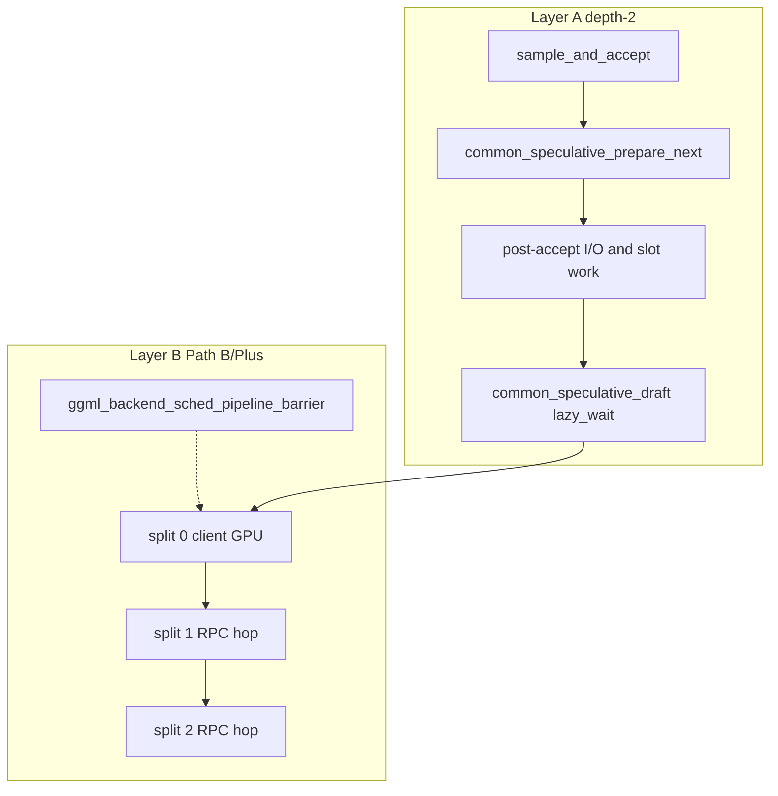

# Pipeline overlap — depth-2 speculative + Path-B Plus multi-backend

> Scope: **Path-B-Event-Support-Pipeline-Plus** branch of
> `atomic-llama-cpp-turboquant`. This document covers the **two shipped pipeline
> layers** that stack on top of MTP/NextN speculative decoding and TurboQuant KV:
>
> 1. **Layer A — server depth-2** — overlap MTP draft compute with per-iteration
>    post-accept work in `llama-server` (`prepare_next` / lazy `_wait`).
> 2. **Layer B — GGML Path B/Plus** — overlap graph **splits** across multi-device
>    backends (local CUDA/ROCm + RPC workers) via backend `events` and copy slots
>    (`n_copies = 4`, `GGML_PIPELINE_PLUS`).
>
> **"Events" here** means `ggml_backend` async compute and `event_record` /
> `event_wait` (including RPC `RPC_CMD_EVENT_RECORD`), **not** application-level
> event injection (sensor feeds, API callbacks mid-generation). That layer is not
> shipped; see [Future work](#12-future-work).

See also [MTP.md](MTP.md) (Gemma depth-2 detail), [NEXTN.md](NEXTN.md) (Qwen NextN),
[docs/speculative.md](docs/speculative.md) (CLI), [rpc-patch/README.md](rpc-patch/README.md)
(multi-node ops), and [docs/cuda-windows-5070ti/CLUSTER-4GPU-PRIMARY.md](docs/cuda-windows-5070ti/CLUSTER-4GPU-PRIMARY.md)
(4-GPU production topology).

---

## 1. What pipeline means here

Both layers hide latency that would otherwise sit on the critical path. They are
**orthogonal** and compose:

| Layer | Hides | Where it runs | Primary knob |
|-------|-------|---------------|--------------|
| **A — depth-2** | MTP / NextN draft graph time between server iterations | `llama-server` speculative loop | `LLAMA_PIPELINE_DEPTH2` |
| **B — Path B/Plus** | Serial wait between graph splits on different GPUs | `ggml_backend_sched` per `llama_decode` | `GGML_PIPELINE_PLUS` |

Neither layer replaces speculative decoding or TurboQuant. A typical multi-GPU
deployment runs **MTP or NextN + TurboQuant KV + depth-2 + Path-B Plus** together.

```text
  llama-server iteration (Layer A)
       |
       v
  common_speculative_draft / target_decode / accept
       |
       v
  llama_decode  --->  ggml_backend_sched (Layer B)
                         split 0 (client GPU)
                         split 1 (RPC worker A)  --events-->
                         split 2 (RPC worker B)  --events-->
                         split 3 (RPC worker C)
```



---

## 2. Components and where they live

| Concern | File(s) |
|---------|---------|
| Depth-2 driver | `common/speculative.cpp`, `common/speculative.h` |
| Server integration / drains | `tools/server/server-context.cpp` |
| Depth-2 design notes | `docs/development/pipeline-depth-2-pure-overlap.md` |
| MTP async APIs | `include/llama.h`, `src/llama-context.cpp` (`sched_mtp`, `decode_mtp_*`) |
| Pipeline detection | `src/llama-context.cpp` (`pipeline_parallel`, device `caps.async` + `caps.events`) |
| Path-B Plus barrier (P0) | `ggml/src/ggml-backend.cpp` (`ggml_backend_sched_pipeline_barrier`) |
| Narrow sampling sync (P1) | `src/llama-context.cpp` (`synchronize_sampling`, `llama_pipeline_plus_enabled`) |
| RPC events + scoped drain (P2) | `ggml/src/ggml-rpc/ggml-rpc.cpp` |
| RPC protocol | `ggml/include/ggml-rpc.h` ([RPC-PROTOCOL.md](docs/rpc-multi-backend-pipeline-plus/RPC-PROTOCOL.md), proto 4.4.2) |
| Scheduler / RPC trace emit | `ggml-backend.cpp`, `ggml-rpc.cpp` |
| Cluster benches / hotpath parse | `rpc-patch/scripts/pathb-*.sh`, `pathb-hotpath-summary.sh` |
| Path B/Plus mission | `docs/rpc-multi-backend-pipeline-plus/` (MISSION, PLAN, TRACKING) |
| Path B/Plus planning | `rpc-patch/docs/rpc-path-b-plus-overview.md` |

---

## 3. Layer A — server depth-2 speculative pipeline

Full MTP-specific detail lives in [MTP.md §7-8](MTP.md). This section is the
unified reference for how depth-2 composes with Layer B.

### Iteration flow

The server normally alternates `draft` and `accept` synchronously inside each
iteration. Depth-2 splits the MTP async pair across **two** iterations:

```text
  loop:
    drafts = common_speculative_draft(...)     # lazy-waits pending MTP first
    target_decode(...)
    n_acc, sampled = sample_and_accept_n(...)
    common_speculative_accept(spec, n_acc)
    seq_rm(...); update slot.sampled / h_idx
    common_speculative_prepare_next(spec, sampled)   # async submit for NEXT round
```

`prepare_next` calls `llama_decode_mtp_async(...)` with:

- `attn_pos = seq_pos_max(seq_id)` **after** `seq_rm`,
- the real sampled token (no optimistic guess),
- `h_prev` from `embeddings_ith(h_idx)` where `h_idx` points at the **last
  accepted** batch row (see [MTP.md §8](MTP.md)).

On the next iteration, if a request is pending and `n_steps` is unchanged,
`common_speculative_draft` takes the **lazy** path: `llama_decode_mtp_wait`
first, overlapping MTP compute with token I/O, OAI streaming, slot bookkeeping,
and the next prefill.

### KV safety contract

- Target `llama_decode` appends only at positions **strictly after** `attn_pos`
  until `_wait` returns; backbone cells MTP reads remain stable (append-only KV).
- When `n_steps` changes or KV is about to be mutated destructively, the driver
  **drains** in-flight MTP (`mtp_drain_pending_discard` / `common_speculative_cancel`).

**Server drain points** (`tools/server/server-context.cpp`):

1. Iteration **skips** speculative decoding (`n_remaining == 1`, etc.).
2. After `send_final_response` / `slot.release`.
3. In `common_speculative_begin` (new prompt).

### Applicability

| Spec type | Depth-2 benefit | Notes |
|-----------|-----------------|-------|
| `mtp` (Gemma 4) | High | Primary design target; async `sched_mtp` worker |
| `nextn` (Qwen 3.6) | MoE: high; dense 27B: modest | Draft-compute-bound on dense 27B ([NEXTN.md §7](NEXTN.md)) |
| `draft` / `ngram_*` | N/A | Separate code paths; `prepare_next` is no-op |

### Knob

| Var | Default | Effect |
|-----|---------|--------|
| `LLAMA_PIPELINE_DEPTH2` | unset (on) | `=0` disables `prepare_next`; restores sync `_async + _wait` inside `draft` |

---

## 4. Layer B — GGML Path B event pipeline + Path-B Plus

Layer B is what the branch name **Path-B-Event-Support** refers to: backend-level
events that let the GGML scheduler run multiple graph splits in an assembly line
instead of blocking on each hop.

### Preconditions (`src/llama-context.cpp`)

Pipeline parallelism activates when **all** of the following hold:

- `model.n_devices() > 1`
- Full layer offload (`n_gpu_layers > n_layer_all`)
- `split_mode == LLAMA_SPLIT_MODE_LAYER`
- `offload_kqv` enabled
- No tensor overrides
- Every non-CPU backend reports `caps.async == true` **and** `caps.events == true`

When active, the constructor logs `pipeline parallelism enabled` and allocates
`sched` with `n_copies = 4` (see `ggml_backend_sched_get_n_copies` in server
load logs: `sched copies = 4`).

### Path B — RPC event unlock

Before Path B, RPC backends reported `caps.events = false`, forcing the scheduler
into sequential mode even on multi-RPC topologies. Path B adds:

- `RPC_CMD_EVENT_RECORD` (proto minor bump to 4.2.2+)
- Client-side `rpc_event_t` + deferred TCP I/O
- Server handler that signals compute completion via TCP ordering after
  `GRAPH_RECOMPUTE`
- `caps.async = true`, `caps.events = true` on RPC backends

Implementation detail: [rpc-patch/patch/PATH_B_EVENT_SUPPORT_IMPLEMENTATION.md](rpc-patch/patch/PATH_B_EVENT_SUPPORT_IMPLEMENTATION.md).

### Path-B Plus — unblock graph reuse overlap

Path B enabled the pipeline, but multi-hop clusters still plateaued because:

1. Graph **reuse** called full `sched_synchronize` every token (copy slot never rotated).
2. RPC `send_rpc_cmd` **drained** pending events on fire-and-forget sends, collapsing overlap windows.

Path-B Plus (B+1 Tier 0) fixes:

| Fix | Code | Effect |
|-----|------|--------|
| **P0** pipeline barrier | `ggml_backend_sched_pipeline_barrier` | Rotate `cur_copy` on graph reuse; `event_wait` per slot instead of full sched sync |
| **P1** narrow sampling sync | `llama_context::synchronize_sampling` | When `GGML_PIPELINE_PLUS=1`, sync only logits/sampling tensors |
| **P2** scoped RPC drain | `ggml-rpc.cpp` `send_rpc_cmd` | Drain events only on **blocking** RPC ops |
| **P3** trace / overlap metric | `GGML_SCHED_TRACE`, `pathb-rpc-trace-parse` | `assembly_overlap_count` in hotpath summary |

On graph reuse with Plus enabled (`src/llama-context.cpp`):

```cpp
if (cparams.pipeline_parallel && llama_pipeline_plus_enabled()) {
    ggml_backend_sched_pipeline_barrier(sched.get());
} else {
    ggml_backend_sched_synchronize(sched.get());
}
```

### Production knobs

| Setting | Typical value | Notes |
|---------|---------------|-------|
| `GGML_PIPELINE_PLUS` | `1` (default on) | `=0` restores legacy Path B full-sync on reuse |
| `--rpc` | e.g. `192.168.8.176:50051,127.0.0.1:50051,192.168.8.21:50053` | Multi-hop endpoint list |
| `-ts` | VRAM-proportional split | e.g. `36,24,24,16` for 4-GPU primary |
| RPC proto | **4.4.2** (cluster); 4.3.2+ min | `COPY_TENSOR_PEER` (4.3), `CHANNEL_BIND` dual-socket (4.4, default OFF) |
| `GGML_RPC_DUAL_SOCKET` | `0` (default) | `=1` splits cmd/rsp TCP per endpoint; see [FEATURE-b11](docs/rpc-multi-backend-pipeline-plus/FEATURE-b11-dual-socket-rpc.md) |

### B+11 dual-socket RPC (proto 4.4)

Optional cmd/response TCP split per RPC endpoint to reduce HOL blocking on multiplexed sockets. Shipped with proto bump to **4.4** (`RPC_CMD_CHANNEL_BIND`). **Default OFF** after 4-GPU bisect NULL on overlap and -9% G regression.

```bash
# Experiment only (all rpc-servers must be 4.4)
export GGML_RPC_DUAL_SOCKET=1
```

Docs: [FEATURE-b11-dual-socket-rpc.md](docs/rpc-multi-backend-pipeline-plus/FEATURE-b11-dual-socket-rpc.md), [RPC-PROTOCOL.md](docs/rpc-multi-backend-pipeline-plus/RPC-PROTOCOL.md).

### Verify after deploy

1. Server log: `pipeline parallelism enabled`, `sched copies = 4`
2. RPC workers: HELLO `proto 4.4` (or branch-appropriate build); `dual=no` unless experimenting
3. Trace run: `assembly_overlap_count > 0` during generation
4. Throughput in expected band for topology (see [Performance](#9-performance-considerations))
5. Matrix: `bash scripts/b6-gate-validate-rpc-matrix.sh`

---

## 5. Integration with MTP / NextN / TurboQuant / multimodal

### Speculative + both pipeline layers

| Combo | Expected interaction |
|-------|---------------------|
| MTP + depth-2 + Plus | Default high-throughput Gemma path on single- or multi-GPU |
| NextN + depth-2 + Plus | Best on MoE (35B-A3B); dense 27B gains are overlap-limited |
| TurboQuant `turbo3` KV | Stacks cleanly; extra draft dequant cost often hidden by depth-2 overlap |
| `--mmproj` | Text-only turns: full stack active. Image turns: draft prime skipped per turn ([NEXTN.md §10](NEXTN.md)); Layer B unaffected |

### KV trimming under speculative load

- **NextN:** `llama_set_nextn` pairs target and draft contexts;
  `llama_context_nextn_seq_rm` trims both KVs together ([NEXTN.md §1](NEXTN.md)).
- **MTP:** no draft KV; cross-attention reads target KV via `mtp_slot_info`
  ([MTP.md §3](MTP.md)). Depth-2 drain points prevent reads after `seq_rm`.
- **TurboQuant:** compressed KV layouts (`turbo2`/`turbo3`/`turbo4`) use the same
  append-only contract; turbo3 adds dequant noise that UDT Q/K masks mitigate
  ([NEXTN.md §8](NEXTN.md)).

### What Layer B does not change

- Speculative accept/reject logic, draft token generation, or tokenizer behavior.
- Model split assignment (`-ts`) — only how splits are **scheduled** once assigned.
- Load-time `load_tensors` fan-out (still serial per worker; dominated by
  `SET_TENSOR_HASH` on first load).

---

## 6. Observability and tracing

`GGML_PIPELINE_TRACE` tags scheduler splits with `decode_id` and records
`pipeline_barrier` events in `pipeline-trace.jsonl`. Layer-specific tools
below still apply; joining depth-2 MTP traces by timestamp remains manual.

### Layer A — speculative acceptance (`LLAMA_MTP_ACC_TRACE`)

Set `LLAMA_MTP_ACC_TRACE=1` (stderr) or `LLAMA_MTP_ACC_TRACE=/path/to.ndjson`
(append). Emitted from `common/speculative.cpp` when enabled.

Two NDJSON events per iteration, paired by `iter`:

| Event | Key fields |
|-------|------------|
| `mtp_draft` | `path` (`sync`/`lazy`/`skip-streak`/`skip-nsteps`), `seq_id`, `id_last`, `h_idx`, `attn_pos`, `n_steps`, `h_l2`, `drafts[]` |
| `mtp_accept` | `n_accepted`, `n_drafted_prev` |

Example (illustrative):

```json
{"event":"mtp_draft","iter":42,"path":"lazy","seq_id":0,"id_last":128006,"h_idx":3,"attn_pos":17,"n_steps":2,"h_l2":142.3,"drafts":[882,441]}
{"event":"mtp_accept","iter":42,"n_accepted":1,"n_drafted_prev":2}
```

Join on `iter` to see depth-2 lazy vs sync distribution and acceptance stability.
Full field reference: [MTP.md §10](MTP.md).

### Layer B — scheduler splits (`GGML_SCHED_TRACE`)

| Var | Effect |
|-----|--------|
| `GGML_SCHED_TRACE=1` | Emit per-split JSON lines |
| `GGML_SCHED_TRACE_FILE=/path` | Append to file instead of stderr |

Schema (`ggml-backend.cpp`):

```json
{"ts_us":1234567890,"split":1,"backend":2,"copy":0,"phase":"split_total","elapsed_us":9623}
```

Phases include `input_wait_copy`, `graph_compute_async`, `event_record`, `split_total`.

### Layer B — RPC client (`GGML_RPC_TRACE`)

| Var | Effect |
|-----|--------|
| `GGML_RPC_TRACE=1` | Emit per-RPC-op JSON lines |
| `GGML_RPC_TRACE_FILE=/path` | Append to file |

Schema (`ggml-rpc.cpp`):

```json
{"ts_us":1234567890,"fn":"send_rpc_cmd","phase":"done","cmd":18,"bytes":16,"blocking":false,"elapsed_us":412}
```

### Cluster hotpath summary (`BENCH_TRACE=1`)

For multi-node benches, enable `BENCH_TRACE=1` on the romulus client launcher
(`pathb-romulus-4gpu-bench.sh`, etc.), then parse telemetry:

```bash
./rpc-patch/scripts/pathb-hotpath-summary.sh /path/to/telemetry/
```

Key outputs (4-GPU primary, 2026-06-27):

| Metric | Value | Notes |
|--------|-------|-------|
| Serial split sum | 20.71 ms/tok | 332 decode tokens |
| backend1 (5060) | 9.63 ms/tok | Straggler |
| backend2 (3060) | 5.51 ms/tok | |
| backend3 (5070) | 5.41 ms/tok | |
| `assembly_overlap_count` | 1075 | overlap_pct ~0.1% |
| `SET_TENSOR_HASH` (load) | 6478 ms / 280 calls | Load phase only |

Source: [rpc-patch/patch/bench-results/cluster-4gpu-primary/summary.md](rpc-patch/patch/bench-results/cluster-4gpu-primary/summary.md).

### Trace workflow (multi-GPU)

```powershell
# Windows 2-GPU validation
.\scripts\cuda-windows-5070ti\pathb-trace-runbook.ps1 -Runs trace-f-2gpu-plus
.\scripts\cuda-windows-5070ti\pathb-rpc-trace-parse.ps1 -TraceDir docs\cuda-windows-5070ti\benchmarks\trace-f-2gpu-plus\telemetry
```

```bash
# Romulus 4-GPU trace (HTTP gate)
BENCH_TRACE=1 ./rpc-patch/scripts/pathb-romulus-4gpu-bench.sh trace-g-4gpu-primary-trace
./rpc-patch/scripts/pathb-hotpath-summary.sh .../telemetry

# Native client profiler + diagnose (preferred for T1 A/B)
cmake --build build --target llama-pipeline-profiler
./scripts/llama-pipeline-profiler-cluster.sh profiler-4gpu-primary
./scripts/llama-pipeline-diagnose.sh <out>/telemetry --gen-only
```

See [docs/llama-pipeline-profiler/OVERVIEW.md](docs/llama-pipeline-profiler/OVERVIEW.md).

---

## 7. Usage and examples

### Single-node Gemma MTP + depth-2

```bash
# Default: depth-2 on, async MTP pipeline
scripts/run-gemma4-mtp-server.sh

# A/B: disable depth-2 overlap
LLAMA_PIPELINE_DEPTH2=0 scripts/run-gemma4-mtp-server.sh

# Acceptance debug trace
LLAMA_MTP_ACC_TRACE=/tmp/mtp.ndjson scripts/run-gemma4-mtp-server.sh
```

### 2-GPU production (Path-B Plus, Config F)

Windows RTX 5070 Ti client + remus RTX 5060 Ti RPC (`:50051` only):

```text
GGML_PIPELINE_PLUS=1
--rpc 192.168.8.176:50051
-ts 50,50
```

Ops: [rpc-patch/docs/rpc-path-b-plus-handover.md](rpc-patch/docs/rpc-path-b-plus-handover.md).

### 4-GPU cluster primary (Config G, no RX6600)

| # | GPU | Endpoint |
|---|-----|----------|
| 0 | 7900 XTX | ROCm client (romulus) |
| 1 | 5060 Ti | `192.168.8.176:50051` |
| 2 | 3060 Ti | `127.0.0.1:50051` |
| 3 | 5070 Ti | `192.168.8.21:50053` |

```bash
export PATHB_ROMULUS_SSH_PASS=...
# Windows: scripts/cuda-windows-5070ti/pathb-rpc-server.ps1
# (run rpc-server.exe from build-cuda-b-bin/portable/ cwd)

cd rpc-patch/scripts
BENCH_CTK=q8_0 BENCH_CTV=q8_0 BENCH_NCMOE= BENCH_TRACE=0 GGML_PIPELINE_PLUS=1 \
  ./pathb-romulus-4gpu-bench.sh trace-g-4gpu-primary
```

Do **not** use RX6600 (`:50052`) in production 4-GPU — known hang at `initializing slots`.
Details: [docs/cuda-windows-5070ti/CLUSTER-4GPU-PRIMARY.md](docs/cuda-windows-5070ti/CLUSTER-4GPU-PRIMARY.md).

---

## 8. Where each layer adds value vs overhead

| Layer | Adds value when | Overhead / risk |
|-------|-----------------|-----------------|
| **depth-2** | MTP/NextN drafting active; server does non-trivial post-accept I/O | Near-zero when spec off; drain logic required for KV safety |
| **Path B** | `n_devices > 1`, all backends event-capable | Extra memory for `n_copies = 4` buffer sets |
| **Path-B Plus** | Graph reuse hot path (steady-state decode) | Must keep `GGML_PIPELINE_PLUS=1`; `=0` reverts to per-token full sync |

**Measuring pipeline-specific impact:**

1. **depth-2:** Compare `LLAMA_PIPELINE_DEPTH2=0` vs unset at fixed model/config;
   check `mtp_draft.path` lazy fraction in `LLAMA_MTP_ACC_TRACE`.
2. **Plus:** Compare `GGML_PIPELINE_PLUS=0` vs `1`; inspect `assembly_overlap_count`
   and per-backend `split_total` ms/tok in hotpath summary.
3. **End-to-end:** Use bench labels (`trace-f-2gpu-plus`, `trace-g-4gpu-primary`)
   with median G over 3 runs.

---

## 9. Performance considerations

Published matrices, A/B presets, and profiling workflow: [BENCHMARKING.md](BENCHMARKING.md).
Artifact index: [benches/path-b-plus/](benches/path-b-plus/).

Documented benchmark highlights (do not extrapolate beyond cited hosts/models):

### Single-node speculative (Layer A primary)

MacBook Pro M4 Max, 48 GB, Metal, single slot — see [MTP.md](MTP.md) matrix and
[NEXTN.md §7](NEXTN.md).

| Config | Short tps highlight | Source |
|--------|---------------------|--------|
| gemma-26B f16-mtp | 110.8 (n=128) | MTP.md matrix |
| gemma-26B turbo3-mtp | 80.5 (n=128) | MTP.md matrix |
| qwen-35B-A3B turbo3-nextn | 82.73 (n=128), +33.8% vs base | NEXTN.md §7 |
| Async MTP graph-cache alone | ~+8% (95.3 -> 102.8 tps) | docs/speculative.md |
| depth-2 + in-graph argmax | additional ~+2-3% | docs/speculative.md |

### Multi-GPU Path-B Plus (Layer B primary)

`Qwen3.6-35B-A3B-UD-IQ4_NL_XL.gguf`, ctx=4096, q4_0 KV — see
[rpc-patch/docs/rpc-path-b-plus-overview.md](rpc-patch/docs/rpc-path-b-plus-overview.md).

| Topology | Plus | G (t/s) | Notes |
|----------|------|---------|-------|
| 3-device F (+ RX6600) | 0 | 38.0 | Pre-Plus baseline |
| 3-device F | 1 | 42.8 | Best 3-GPU; serial splits still dominate |
| 2-device F (`ts=50,50`) | 1 | **48.9** | **Production default** |
| 4-GPU primary (7900+5060+3060+5070) | 1 | 38-43 | Load ~85s; [cluster summary](rpc-patch/patch/bench-results/cluster-4gpu-primary/summary.md) |

**Takeaway:** 2-device F is the throughput sweet spot for 36B-class MoE on this
fork today. 4-GPU extends VRAM capacity; per-token serial split sum (~21 ms/tok)
limits G versus 2-GPU when the model fits.

---

## 10. Implementation notes and open points

| Item | Status | Workaround / tracking |
|------|--------|----------------------|
| RX6600 in 4-GPU | Hang at `initializing slots` | Use 5070 `:50053` topology |
| `bench-5gpu.sh` curl parser | False `RESULT=FAIL` on http=200 | Inference OK; fix parser |
| Windows `rpc-server.exe` hidden start | Worker may exit if wrong cwd | Run from `build-cuda-b-bin/portable/` |
| 3-device F 45+ t/s target | Not achieved | Use 2-device F for throughput |
| Path C unified remus server | Deferred | [rpc-patch/docs/rpc-path-c-tracking.md](rpc-patch/docs/rpc-path-c-tracking.md) |
| 5-GPU / 72B+ cluster (S0) | Deferred | `pathb-72b-cluster-matrix.sh` |

---

## 11. Future work

- **Path C / Phase 6:** unified multi-GPU on remus; tighter split overlap when
  5060+6600 collapse to one host rpc-server.
- **5-GPU cluster:** 3090+3070 node bring-up without RX6600.
- **Deeper split overlap:** reduce 5060 straggler (9.6 ms/tok in 4-GPU trace);
  Tier 1 peer COPY benefits same-host multi-RPC layouts.
- **Unified cross-layer NDJSON tracer:** single env flag correlating depth-2
  `mtp_draft` events with `GGML_SCHED_TRACE` splits (not implemented).
- **External event / prompt injection pipeline:** non-blocking enqueue of user
  triggers into the generation loop (not implemented).

---

## 12. Quick reference

### Environment variables

| Var | Layer | Default | Effect |
|-----|-------|---------|--------|
| `LLAMA_PIPELINE_DEPTH2` | A | unset (on) | `=0` disables `prepare_next` |
| `LLAMA_MTP_ACC_TRACE` | A | off | `1` or file path; NDJSON draft/accept |
| `LLAMA_MTP_SKIP_STREAK_THRESHOLD` | A | off | Adaptive zero-accept skip (1-32) |
| `GGML_PIPELINE_PLUS` | B | on (`!=0`) | P0 barrier + P1 narrow sync; `=0` legacy |
| `GGML_SCHED_TRACE` | B | `0` | Per-split scheduler JSON |
| `GGML_SCHED_TRACE_FILE` | B | unset | Scheduler trace file path |
| `GGML_RPC_TRACE` | B | `0` | Per-op RPC client JSON |
| `GGML_RPC_TRACE_FILE` | B | unset | RPC trace file path |
| `GGML_PIPELINE_TRACE` | B | `0` | `decode_id` on sched lines + barrier jsonl |
| `GGML_PIPELINE_TRACE_FILE` | B | unset | Pipeline barrier trace path |
| `BENCH_TRACE` | B (ops) | `0` | Full telemetry on cluster benches |

### Commands

```bash
# depth-2 A/B
LLAMA_PIPELINE_DEPTH2=0 scripts/run-gemma4-mtp-server.sh

# 2-GPU Plus validation (Windows)
.\scripts\cuda-windows-5070ti\pathb-trace-runbook.ps1 -Runs trace-f-2gpu-plus

# 4-GPU cluster smoke (romulus)
BENCH_CTK=q8_0 BENCH_CTV=q8_0 GGML_PIPELINE_PLUS=1 \
  ./rpc-patch/scripts/pathb-romulus-4gpu-bench.sh trace-g-4gpu-primary

# remus RPC rebuild
./rpc-patch/scripts/pathb-remus-rpc.sh rebuild
```

### Driver entry points (Layer A)

```c
common_speculative_prepare_next(spec, id_last);  // depth-2 async submit
common_speculative_draft(spec);                  // lazy wait if pending
common_speculative_cancel(spec);                 // drain in-flight MTP
common_speculative_set_h_idx(spec, batch_idx);   // last accepted hidden row
```

### Scheduler entry points (Layer B)

```c
ggml_backend_sched_pipeline_barrier(sched);      // Path-B Plus P0
llama_context::synchronize_sampling();           // Path-B Plus P1 (when Plus on)
```

Further reading: [MTP.md §14](MTP.md), [rpc-patch/docs/rpc-path-b-plus-overview.md](rpc-patch/docs/rpc-path-b-plus-overview.md).