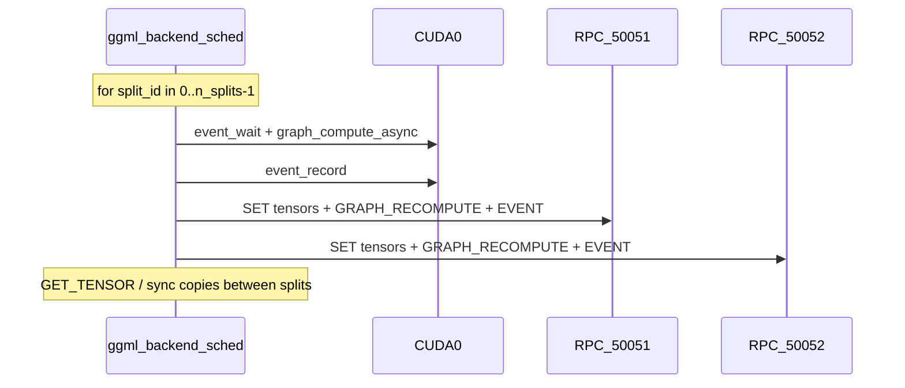

# RPC Wait-Site Map (36B NL MoE)

Static map of blocking paths for Qwen3.6-35B-A3B-UD-IQ4_NL_XL on Config F vs 2-device topologies. Derived from profile logs and ggml source audit.

## Topology comparison

| Run | Devices | graph splits | G (t/s) |
|-----|---------|--------------|---------|
| profile-f-36b-nl-base | CUDA0 + RPC:50051 + RPC:50052 | **4** | 37.0 |
| profile-f-36b-nl-no6600 | CUDA0 + RPC:50051 | **3** | 48.9 |
| profile-e-36b-nl | CUDA0 + RPC:50051 | **3** | 42.4 |

Weight map (3-device F):

| Backend | Weights (MiB) | Role |
|---------|---------------|------|
| CUDA0 (5070) | 10186 | Largest compute share |
| RPC0 :50051 (5060) | 5737 | Mid layers |
| RPC1 :50052 (6600) | 2148 | Small tail; **straggler hop** |

Pipeline: enabled. `sched copies = 4` (token-level overlap only).

## Per-token execution model

Splits run **sequentially** in `ggml_backend_sched_compute_splits` ([`ggml-backend.cpp:1549`](ggml/src/ggml-backend.cpp)). Path B overlaps **tokens** via `n_copies=4`, not splits within one token.

## Wait sites by layer

### Client scheduler (`ggml-backend.cpp`)

| Site | Lines | Blocking? | Effect |
|------|-------|-----------|--------|
| `ggml_backend_sched_compute_splits` split loop | 1549-1722 | yes (serial) | Each split waits for prior split inputs |
| `event_wait` / `event_synchronize` on split inputs | 1562-1574 | yes | Drains prior backend before copy |
| `ggml_backend_synchronize` fallback (no events) | 1565, 1573 | yes | Full backend drain |
| `ggml_backend_tensor_copy` cross-RPC | via `ggml_backend_tensor_copy` | yes | No `cpy_tensor_async` on RPC |
| MoE weight copy path | 1588-1588 | yes | Extra `synchronize(input_backend)` |
| `ggml_backend_graph_compute_async` | 1678 | returns early on RPC | Fire-and-forget GRAPH to server |
| `event_record` after split | 1717-1720 | deferred on RPC | TCP EVENT_RECORD RTT later |

### RPC client (`ggml-rpc.cpp`)

| Site | Lines | Blocking? | Per-token impact |
|------|-------|-----------|------------------|
| `send_rpc_cmd` drain preamble | 439-441, 459-461 | yes | Flushes pending EVENT + GET + SET batch before **every** cmd |
| `send_rpc_cmd` + recv (GET_TENSOR, etc.) | 457-475 | yes | Full RTT |
| `send_rpc_cmd` fire-and-forget (SET, GRAPH) | 438-452 | partial | Send blocks; no recv until drain |
| `flush_pending_get_tensor` | 314-336 | yes | Blocking recv all pipelined GETs |
| `drain_pending_event_response` | 304-312 | yes | Blocking EVENT recv |
| `ggml_backend_rpc_graph_compute` | 944-979 | GRAPH_RECOMPUTE + deferred EVENT | 1-2 RPC ops per RPC split per token |
| `get_socket` | ~503 | serial | One TCP stream per host:port |
| `COPY_TENSOR` cross-socket | ~709 | disabled | Falls back to GET+SET (2 RTTs) |
| `cpy_tensor_async` | 989 | NULL | Forces sync copy path in scheduler |

### RPC server (`ggml-rpc.cpp` `rpc_serve_client`)

| Site | Lines | Blocking? | Effect |
|------|-------|-----------|--------|
| Command loop | 1726+ | serial | One cmd at a time per connection |
| `RPC_CMD_GRAPH_COMPUTE` | server `graph_compute` 1646 | yes | Sync `ggml_backend_graph_compute` before next recv |
| `RPC_CMD_GRAPH_RECOMPUTE` | 1662 | yes | Sync recompute |
| `RPC_CMD_GET_TENSOR` | handler | yes | Sync send payload to client |
| `RPC_CMD_EVENT_RECORD` | 1990+ | ACK only | "Prior cmds done" via TCP order |

### llama-context (`src/llama-context.cpp`)

| Site | Approx | Blocking? | Effect |
|------|--------|-----------|--------|
| Graph reuse + `pipeline_parallel` | ~1360 | yes (legacy) / barrier (Plus) | `sched_synchronize` or `pipeline_barrier` before set_inputs |

## Estimated RPC ops per token (3-device F)

| Opcode | Count (order of magnitude) | Blocks client? |
|--------|---------------------------|----------------|
| SET_TENSOR / SET_TENSOR_BATCH | 5-20+ (inputs, KV indices) | drain + batch flush |
| GRAPH_RECOMPUTE | 2 (per RPC device) | deferred EVENT |
| EVENT_RECORD | 2+ | recv on drain/wait |
| GET_TENSOR | 1+ (logits / cross-split) | yes |
| COPY_TENSOR | 0 cross-endpoint; same-server maybe | varies |

**Total RTTs/token:** roughly `2 * n_splits + 2` to `7-22+` per [`rpc-path-c-tracking.md`](rpc-patch/docs/rpc-path-c-tracking.md).

Adding 6600: **+1 split**, **+1 GRAPH_RECOMPUTE stage**, **+cross-endpoint copies** between :50051 and :50052.

## Why more TFLOPS lowers G

1. **Amdahl:** token time ~= sum(split stage latencies), not sum(GPU FLOPs).
2. **6600** holds only 2.1 GB weights but adds a full RPC split + TCP hop to a weak GPU.
3. **Low util%:** GPUs burst compute then sit idle while client thread runs drain/recv on single-threaded RPC stream.
4. **Not hardware:** PCIe/NIC/RAM headroom ample during GEN ([`PROFILING.md`](PROFILING.md)).

## Path-B Plus status (B+1)

| Wait site | Fix | Status |
|-----------|-----|--------|
| sched sync on graph reuse | P0 `pipeline_barrier` + `GGML_PIPELINE_PLUS` | SHIPPED |
| llama_get_logits sync | P1 `synchronize_sampling` | SHIPPED |
| send_rpc_cmd drain (fire-and-forget) | P2 scoped drain | SHIPPED |
| tls.ev stale response_pending | P2.1 rpc_finish_event_response | SHIPPED |
| COPY cross-port | B+3 COPY_TENSOR_PEER (v4.3) | CLIENT SHIPPED / server deploy pending |
| cpy_tensor_async NULL | B+2 deferred COPY | SHIPPED |

## Instrumentation targets (Phase 2)

Measure ms and call counts at:

- `send_rpc_cmd` (blocking vs not)
- `drain_pending_event_response` / `flush_pending_get_tensor`
- `ggml_backend_sched_compute_splits` per-split phases
- `rpc_server::graph_compute` server-side duration

Env: `GGML_RPC_TRACE=1`, `GGML_SCHED_TRACE=1`, output under `benchmarks/trace-*/telemetry/`.