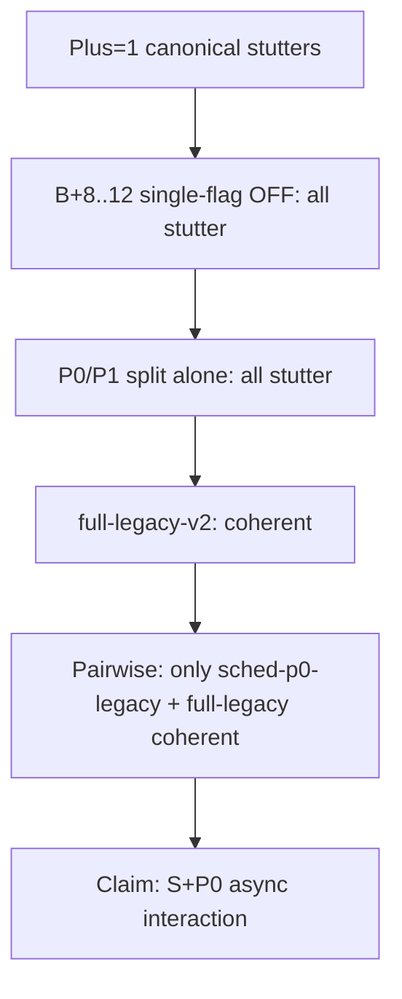

# REDTEAM — Plus=1 TSC identification evidence

| Field | Value |
|-------|-------|
| **Date** | 2026-07-03 |
| **Scope** | Phase 1f bisect + pairwise matrix @ `09e3f0fe3` |
| **Primary doc** | [BUGFIX-plus1-tsc-semantic-collapse.md](BUGFIX-plus1-tsc-semantic-collapse.md) |

Adversarial review of collected evidence before committing to a production fix. Goal: surface false positives, untested assumptions, and alternative hypotheses.

## Executive summary

The identification chain is **directionally sound** but **not proof-complete**. Strongest claim supported today:

> Plus=1 stutter is an interaction requiring backend/RPC async (S) **and** llama graph-reuse barrier async (P0) simultaneously. Disabling both restores coherence while keeping P1 narrow sync and `GGML_PIPELINE_PLUS=1`.

Weaker or unproven claims should not drive a fix without witness data.

## Evidence chain (what we actually proved)

| Step | Confidence | Why |
|------|------------|-----|
| Plus=1 vs Plus=0 delta | **High** | Reproduced across 2/3/4-GPU TSC matrix |
| B+8..12 not root cause | **High** | All single + all-off still stutter |
| P0 or P1 alone insufficient | **High** | p0-legacy, p1-legacy stutter |
| S alone insufficient | **High** | sched-legacy stutters |
| S+P0 legacy sufficient | **Medium-high** | One arm (`sched-p0-legacy`), 2-GPU only |
| GDN recurrent state corruption | **Low** | No hash/GDB witness yet |
| Frontier name-regex / pin-ROCm0 | **Ruled out / deferred** | Wrong tensor names; pin not tested |

## Attack surface 1 — GATE_B heuristic (automated preview classifier)

**Method:** `coherent_preview()` in bisect scripts regex-scans 200-char fox previews for morpheme loops, `Here` repetition, short text.

**Weaknesses:**

1. **Truncation bias** — bench captures ~200 chars. Late-step divergence may be missed if early tokens look fine.
2. **False negative on `sched-p1-legacy`** — classifier correctly flagged stutter (`ppppangangangramram`), but a human might also call run 1 "partially coherent before collapse." Heuristic is coarse.
3. **False positive risk** — `llama-legacy` run 1 (`study guide... table桌面`) might pass a lax human check but fails repetition rules. Conservative bias favors "stutter."
4. **No semantic scoring** — pangram keyword match is a weak positive signal; model could mention "alphabet" while still wrong elsewhere.
5. **Three runs, no statistical test** — arms are classified on aggregate script logic, not per-run majority vote documented in the table.

**Mitigation before fix ship:**

- Human spot-check full generations (extend bench to save complete output, not 200-char preview).
- Add per-run GATE_B column; require 2/3 runs coherent for PASS.
- Optional: perplexity or n-gram entropy threshold on full 128-token output.

## Attack surface 2 — SCHED_LEGACY couples two surfaces

`GGML_PIPELINE_SCHED_LEGACY=1` disables Plus in **both**:

- `ggml_sched_pipeline_plus_enabled()` (`ggml-backend.cpp`)
- `rpc_pipeline_plus_enabled()` (`ggml-rpc.cpp`)

**Weakness:** Pairwise matrix cannot separate backend copy-slot rotation from RPC EVENT/GET defer. We label the pair "S" but the minimal fix might need only one.

**Alternative hypothesis:** RPC defer drain alone (without sched copy-slot change) plus P0 full sync might suffice. Untested arm would be:

- Split `SCHED_LEGACY` into `GGML_PIPELINE_SCHED_ONLY_LEGACY` vs `GGML_RPC_ONLY_LEGACY` (debug knobs only).

**Risk if ignored:** Surgical fix might over-sync backend sched when only RPC ordering matters (perf loss).

## Attack surface 3 — P0 barrier vs "full sync" semantics

`GGML_PIPELINE_P0_FULL_SYNC=1` replaces `ggml_backend_sched_pipeline_barrier` with `sched_synchronize` on graph reuse — a blunt fence, not a targeted GDN guard.

**Alternative hypotheses not ruled out:**

| Hypothesis | Evidence for | Evidence against |
|------------|--------------|------------------|
| **H1:** `cur_copy` rotation serves stale GDN `s` tensor | S+P0 interaction; frontier GDN architecture | No tensor hash witness |
| **H2:** RPC logits GET returns before remote GDN step completes | P1-only legacy still stutters when S+P0 async; sched-p0 coherent with P1 narrow | P1 narrow supposedly syncs logits only |
| **H3:** Graph reuse count (272 vs 127) correlates with corruption | Canonical high reuse + stutter | full-legacy also reuses graphs (127) coherently |
| **H4:** Sampler reads logits from wrong copy slot | p1-legacy stutters with S+P0 async | sched-p0-legacy coherent with P1 narrow — weakens pure logits-stale theory |
| **H5:** MoE path poisons non-MoE state under overlap | MoE in model; B+10 OFF did not help | B+10 is copy-slot MoE async, not GDN |

**Strongest falsification target:** H4 — if P1 narrow sync were the sole stale-logits path, `p1-legacy` disabling only P1 should sometimes help; it does not. Stale logits may be a symptom, not the earliest divergence.

## Attack surface 4 — topology and workload specificity

All bisect arms: **2-GPU fox**, `ts=50,50`, `q8_0`, Qwen3.6-35B-APEX GDN+MoE, `ncmoe=none`, remus `:50051`.

**Untested:**

- 3-GPU / 4-GPU with pairwise winner (`sched-p0-legacy` equivalent).
- Non-fox prompts (math, code, long context).
- Other models without GDN (would isolate architecture-specific vs generic Plus bug).
- `ncmoe` expert paths enabled.

**Risk:** Fix tuned on 2-GPU may fail on 4-GPU where RPC defer depth and copy-slot count differ.

## Attack surface 5 — bench infrastructure flakes

`sched-legacy` first run hit `curl error (http=200)` with inference completing server-side (known parser flake in `rpc-server-bench.sh`). Resume succeeded.

**Impact:** Low for this matrix (all arms eventually completed). Documented as operational noise, not semantic signal.

## Attack surface 6 — pos_min=17 checkpoint warning

Still appears on coherent arms (`full-legacy`, `sched-p0-legacy`, `plus0`). Correctly ruled out as root cause.

## Attack surface 7 — throughput parity

All arms ~45-52 G t/s. Stutter is **not** throughput-collapse; it is semantic. Good for diagnosis (not a perf cliff) but means we cannot use t/s as a secondary gate.

## Contradictions and reconciliations

| Apparent contradiction | Reconciliation |
|------------------------|----------------|
| Earlier "all three surfaces required" vs `sched-p0-legacy` | Pairwise refines: P1 async is **tolerated** when S+P0 are legacy. Original claim was "disabling any **one** surface alone is insufficient" — still true. |
| `p0-legacy` stutters but `sched-p0-legacy` coherent | P0 alone cannot fix without S legacy. Confirms **interaction**, not independent P0 bug. |
| `sched-p1-legacy` stutters | P1 legacy without P0 legacy is insufficient; P0 is the critical llama-side partner for S. |

## Recommended falsification experiments (ordered)

1. **GDN state hash witness** — at token ~20-30, compare `s` tensor checksum: `canonical` vs `sched-p0-legacy` vs `plus0`. If equal, GDN hypothesis weakens; if divergent, frontier Stratum 2 gains support.
2. **Split S knob** — backend-only vs RPC-only legacy + P0 full sync on 2-GPU.
3. **3-GPU pairwise winner** — run `sched-p0-legacy` equivalent on 3-GPU TSC topology.
4. **Full-output capture** — disable preview truncation; human + entropy gate on 128 tokens.
5. **Non-GDN model** — if available on cluster, Plus=1 canonical on pure-attention model: stutter would implicate generic Plus, not GDN-specific.

## Model specificity red-team (2026-07-03)

| Claim | Verdict |
|-------|---------|
| TSC is MTP/NextN inference bug | **Reject** — APEX GGUF has `n_layer_all=40`, no `n_layer_nextn`, `draft: 0 MiB`, main graph skips MTP block |
| TSC is MoE-only | **Reject as primary** — MoE runs but `ncmoe=none`; B+10 alone never fixed; MoE is async surface not root |
| TSC is GDN + multi-backend | **Accept** — 30/40 layers GDN; RS split ROCm/RPC; aligns with S+P0 interaction |
| Fix should target `graph_mtp` | **Reject** — dead code path on this bench |
| Fix should be MoE `MUL_MAT_ID` only | **Reject** — `no-moe-copy` + P0_FULL looked coherent to GATE_B but human audit stutters |

**Falsification still needed:** qwen35 27B dense (48 GDN, no MoE) Plus=1 canonical on 2-GPU.

## S factorial red-team (P0_FULL fixed)

| Arm | GATE_B | Trust |
|-----|--------|-------|
| `sched-legacy` | coherent | **High** — pangram all runs |
| `no-moe-copy` | coherent | **Low** — `!!` repetition; heuristic miss |
| `all-s-off` | stutter | High — disproves "any S flag OFF + P0 is enough" |
| Single-flag OFF arms | stutter | High |

**Conclusion:** `SCHED_LEGACY` master switch is an atomic bundle. Per-flag OFF does not compose to the fix.

## Fix approach red-team (2026-07-03 deep pass)

Full analysis: [BUGFIX-plus1-tsc-ROOTCAUSE.md](BUGFIX-plus1-tsc-ROOTCAUSE.md)

### Superseded bet: F1 + F2a

S factorial completed. **F1 alone and F1+single-S-flag all fail.** F2a (MoE async off) is a GATE_B false positive.

### Revised ship candidate: Tier 1 RECURRENT_GUARD

| Piece | What | Devil's advocate |
|-------|------|------------------|
| **T1a** | Auto P0 `sched_synchronize` on reuse when GDN model | Necessary not sufficient |
| **T1b** | Auto `SCHED_LEGACY` semantics for sched+RPC when GDN model | Proven (`sched-p0-legacy`) but broad — kills Plus defer on MoE too |
| **Combined** | Equivalent to env `P0_FULL_SYNC=1` + `SCHED_LEGACY=1` | Not surgical; acceptable interim per factorial |

**Verdict:** Ship T1 as default-on guard for GDN models. Research Tier 2 only after GDN witness.

### Attacks on "minimal impact"

1. **Any per-token full wait on all backends** (F2b) may erase B+6 overlap gains — measure `overlap_pct` on b6 gate, not fox t/s alone.
2. **F2a only on GDN splits** preserves MoE overlap but misses `build_conv_state` recurrent path if witness shows conv divergence first.
3. **`GGML_SCHED_MAX_COPIES=4`** may be overkill for 2-GPU; depth reduction is a cheap control arm not yet run.
4. **Production default-on guard** for all `is_recr` models affects Qwen3.6, Kimi-linear, Mamba, etc. — scope is correct but breadth untested on 4-GPU.

### Attacks on investigation plan

| Step | Keep? | Note |
|------|-------|------|
| GDN witness via eval callback | **Yes** | Uses existing sched hook; lowest cost proof |
| S factorial | **Yes** | Directly falsifies SCHED_LEGACY coupling concern |
| Trace join | **Yes** | Existing scripts; no C++ required |
| Full-output bench | **Yes** | Gates heuristic risk before ship |
| 3-GPU confirm | **Yes** | Pairwise is 2-GPU only |
| Non-GDN model | **Defer** | Nice-to-have; cluster model availability |
| Split SCHED_LEGACY knobs in prod | **No** | Debug factorial only, not permanent API surface |

## Fix design guardrails (post-red-team)

Do **not** ship:

- Blanket `GGML_PIPELINE_PLUS=0`
- Permanent `SCHED_LEGACY=1` (kills all Plus overlap on sched **and** RPC)
- Permanent `P0_FULL_SYNC=1` globally (full `sched_synchronize` every graph reuse)

**Prefer:**

- Targeted fence at S+P0 handshake (e.g. ensure GDN / recurrent ops complete on all backends before `cur_copy` advance or before graph reuse consumes prior slot).
- Keep P1 narrow sync and RPC MoE overlap where pairwise shows safety.

## Verdict

| Question | Answer |
|----------|--------|
| Is Plus=1 TSC real? | **Yes** — reproducible, not a bench hang artifact |
| Is identification complete enough to **design** a fix? | **Yes, with caveats** — S+P0 interaction is the working hypothesis |
| Is identification complete enough to **ship** a fix? | **No** — need GDN witness or split-S arm; need multi-topology confirmation |
| Biggest residual risk | SCHED_LEGACY conflates backend + RPC; fix may be over-broad or miss the true half |

---

*Red-team review @ 2026-07-03 after pairwise matrix completion.*