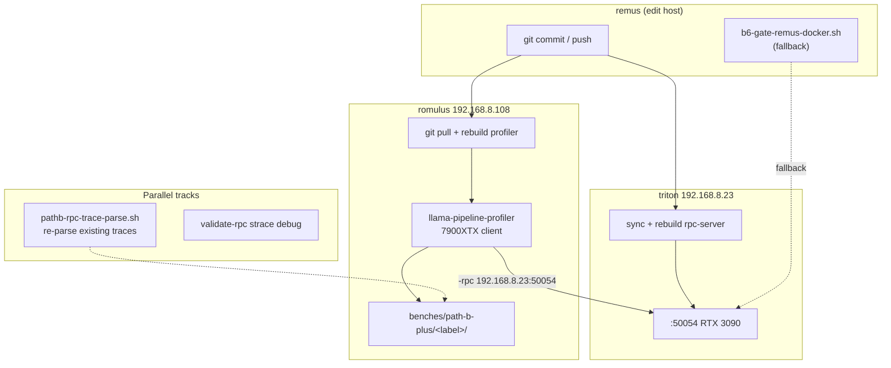
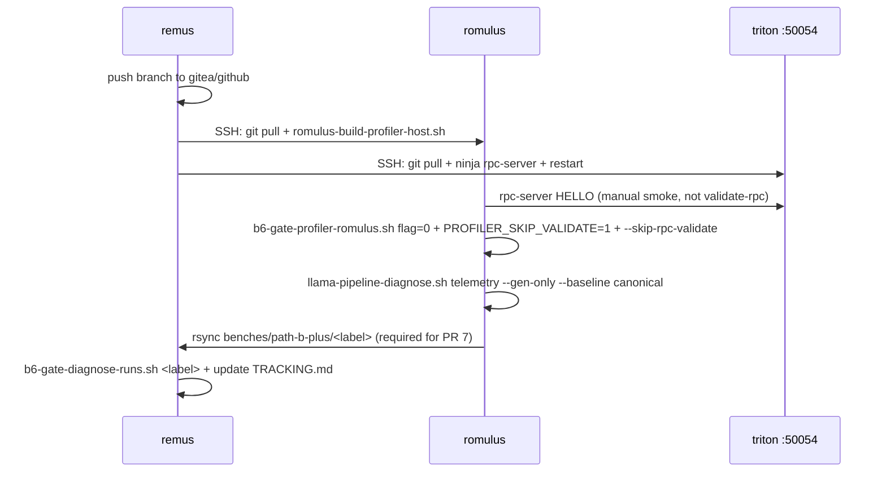

# Design: B+8/B+10 OFF Bisect Protocol on Romulus

| Field | Value |
|-------|-------|
| **Author** | Systems Architecture (draft) |
| **Date** | 2026-07-01 |
| **Status** | Draft |
| **Branch** | `Path-B-Event-Support-Pipeline-Plus` |
| **Mission** | `rpc-multi-backend-pipeline-plus` |
| **ADR** | [0001-b6-ladder-execution-post-b9-null](../docs/adr/0001-b6-ladder-execution-post-b9-null.md) |

---

## Overview

The B+6 overlap gate (M3: `overlap_pct >= 5%`) is **FAIL** on all measured 2-GPU and 4-GPU topologies. B+9 OFF bisect (`GGML_RPC_EVENT_DEFER_BARRIER=0`) on `b6-2gpu-f-triton-n384` produced a **null result** — canonical and no-defer both report 0.2% overlap with stall ≈ 0.87. ADR-0001 locks the next execution steps: run **B+8 OFF** then **B+10 OFF** on 2-GPU triton n=384 on **romulus native** (with remus-docker fallback), in parallel with Phase 1.1 trace re-parsing and validate-rpc hygiene.

This document specifies the **sync protocol**, **environment matrix**, **output directory labels**, **diagnose comparison criteria**, and **Phase 1.1 re-parse scope** so bisect runs are reproducible, comparable, and independently reviewable.

---

## Background & Motivation

### Current state

| Label | `overlap_pct` | `stall_ratio` | `drain_flush_ms` | `straggler_ms/tok` | Verdict |
|-------|---------------|---------------|------------------|--------------------|---------|
| `b6-2gpu-f-triton-n384` (canonical) | 0.2% | 0.867 | 1712 | 8.206 (backend 1) | STRAGGLER_DOMINANT |
| `b6-2gpu-f-triton-n384-no-defer` (B+9 OFF) | 0.2% | 0.870 | 1776 | 8.186 | STRAGGLER_DOMINANT |
| `b6-2gpu-f-triton-n384-b8-partial` (B+8b probe) | 0.2% | 0.863 | 1717 | 8.242 | STRAGGLER_DOMINANT |

Evidence from `b6-2gpu-f` (remus 5060): `stall_ratio=0.95`, `input_wait_copy_ms >> graph_compute_async_ms`, `drain_flush_ms` tracks `EVENT_RECORD` count. Triton swap improved throughput (G ≈ 129 t/s vs 75.6) and cut drain, but overlap moved only 0.2%→0.3% — **pipelining depth**, not drain alone, is the gate lever.

### Pain points

1. **Mitigation flags shipped untested on n=384 triton** — B+8/B+10 code landed 2026-06-30; only B+9 has a completed OFF bisect (null).
2. **Execution host ambiguity** — recent runs used remus-docker; ADR-0001 mandates romulus native primary for gate fidelity (7900XTX client, `/mnt/models`).
3. **validate-rpc hangs** — romulus→triton HELLO path blocks; bisects must use `PROFILER_SKIP_VALIDATE=1` until strace fix lands.
4. **Instrumentation gap** — Phase 1.1 per-split RPC RTT histogram is starter-only in `pathb-rpc-trace-parse.sh`; existing traces can be re-parsed without new bench time.

### Milestones (hard criteria)

| ID | `overlap_pct` | `stall_ratio` | Best measured | Status |
|----|---------------|---------------|---------------|--------|
| M1 | ≥ 1.0% | < 0.80 | **0.9%** (`b6-2gpu-f-triton-guard-n128`; stall 0.636 — overlap criterion met, stall criterion met) | **FAIL** (stall on canonical n=384) |
| M3 (B+6 PASS) | ≥ 5.0% | < 0.50 | 0.9% (triton guard-n128 ref) | **FAIL** |

> **Topology note:** The stale **0.7%** figure is from jupiter n=128 bisect data in `regression.jsonl`, not triton. M1/M3 gate evaluation for this wave uses **triton n=384** canonical (0.2% overlap) and **triton guard-n128** (0.9%) as the in-repo best-measured reference. Do not mix jupiter bisect numbers into triton gate status.

---

## Goals & Non-Goals

### Goals

1. Execute B+8 OFF and B+10 OFF bisects on **2-GPU triton n=384** with romulus as gate client.
2. Define a **sync + rebuild + run** protocol for remus → romulus → triton before each bisect wave.
3. Lock **env matrix** and **output label** naming so `diagnose.json` rows are joinable in `b6-diagnosis-matrix.tsv`.
4. Specify **bisect verdict thresholds** (NULL / MITIGATION_HELPS / MITIGATION_HURTS / M1-PASS) with baseline = client-matched canonical dir (`b6-2gpu-f-triton-n384-remus-docker` or `b6-2gpu-f-triton-n384-romulus-native`) **on the same `client_kind`** as the bisect run.
5. Run **Phase 1.1 re-parse** on existing trace artifacts in parallel (non-blocking).
6. If M1 still FAIL after both OFF bisects: record partial 2-GPU verdict in `TRACKING.md`, then run `b6-4gpu-g` on romulus.

### Non-Goals

- Path C server-side scheduling (deferred per ADR-0001).
- 4-GPU bisects before 2-GPU B+8+B+10 OFF complete.
- Fixing `--validate-rpc` hang in the bisect critical path (parallel hygiene track only).
- New profiler feature development beyond Phase 1.1 parser extensions on existing jsonl.
- Re-running canonical n=384 unless sync/rebuild invalidates prior artifacts (git SHA drift) **or** client kind changes (see dual-baseline policy below).

---

## Proposed Design

### Architecture



### Sequence: one bisect run



---

## Sync Protocol

### Preconditions

| Check | Command / signal |
|-------|------------------|
| **SSH key auth** | Passwordless SSH remus↔romulus↔triton configured; **do not** embed `sshpass` passwords in committed scripts (use `~/.ssh/config` or env `B6_GATE_SSH_KEY`) |
| Branch aligned | `git rev-parse --short HEAD` identical on remus, romulus, triton (±0 after pull); **non-`unknown` `GIT_SHA` in `env.txt`** (PR 6) |
| Triton RPC listening | `ss -tlnp \| grep 50054` on triton; log shows `proto 4.3 peer_copy=yes` |
| Romulus profiler built | `test -x build-rocm-docker/bin/llama-pipeline-profiler` |
| Model present | romulus: `/mnt/models/Qwen3.6-35B-A3B-APEX-I-Quality.gguf` |
| Triton RPC idle | `pkill -f rpc-server` then restart; no stale profiler holding connection |
| **Baseline client match** | Romulus-native bisects compare against `b6-2gpu-f-triton-n384-romulus-native/`; remus-docker bisects against `b6-2gpu-f-triton-n384-remus-docker/` (see dual-baseline policy) |

### Step 1 — remus: publish

```bash
cd /home/hunter/projects/atomic-llama-cpp-turboquant/atomic-llama-cpp-turboquant
git push origin Path-B-Event-Support-Pipeline-Plus
git push gitea Path-B-Event-Support-Pipeline-Plus
```

Gitea remote: `http://192.168.8.108:3005/hunter/atomic-llama-cpp-turboquant.git` (tokens in `~/tokens/` on romulus/remus).

### Step 2 — romulus: sync + rebuild client

```bash
# Prefer: ssh hunter@192.168.8.108  (key auth; no password in scripts)
ssh hunter@192.168.8.108
cd ~/atomic-llama-cpp-turboquant   # PATHB_ROMULUS_REPO default
git fetch gitea --prune
git checkout Path-B-Event-Support-Pipeline-Plus
git reset --hard gitea/Path-B-Event-Support-Pipeline-Plus
git rev-parse --short HEAD

# Native ROCm profiler (primary gate client binary)
bash scripts/romulus-build-profiler-host.sh
# Alt docker build: bash scripts/romulus-build-profiler.sh
```

**Build artifact:** `build-rocm-docker/bin/llama-pipeline-profiler`  
**LD_LIBRARY_PATH:** `build-rocm-docker/bin:/opt/rocm/lib` (set in `b6-gate-profiler-romulus.sh`, `b6-gate-run-remote.sh`).

### Step 3 — triton: sync + rebuild RPC worker

Triton is Ubuntu 24.04 at `hunter@192.168.8.23`. Repo path may be `~/projects/atomic-llama-cpp-turboquant` (single-nested; verify with `git rev-parse --show-toplevel`).

```bash
ssh hunter@192.168.8.23
cd ~/projects/atomic-llama-cpp-turboquant
git fetch gitea --prune
git checkout Path-B-Event-Support-Pipeline-Plus
git reset --hard gitea/Path-B-Event-Support-Pipeline-Plus

# Incremental rebuild after ggml-rpc changes
rm -rf build-cuda-b-bin/ggml/src/ggml-rpc/CMakeFiles/ggml-rpc.dir
cmake --build build-cuda-b-bin -j4 --target rpc-server

pkill -f rpc-server || true
nohup ./build-cuda-b-bin/bin/rpc-server -H 0.0.0.0 -p 50054 \
  > /tmp/triton-rpc-50054.log 2>&1 &
```

Legacy Windows path: `scripts/b6-gate-triton-sync-rebuild.ps1` (portable build + `pathb-rpc-server.ps1 -Restart`).

### Step 4 — smoke (no validate-rpc gate)

```bash
# Manual: confirm port open from romulus
ssh hunter@192.168.8.108 \
  'timeout 3 bash -c "echo >/dev/tcp/192.168.8.23/50054" && echo RPC_PORT_OK'
```

Do **not** block bisect on `--validate-rpc` (known hang after `ggml_cuda_init`). Use `PROFILER_SKIP_VALIDATE=1` **and** `--skip-rpc-validate`.

> **Execution blocker (current tree):** `PROFILER_SKIP_VALIDATE=1` only skips the **bash** `validate_rpc()` in `llama-pipeline-profiler-cluster.sh`. The profiler binary still calls `run_rpc_validate()` unless `--skip-rpc-validate` is passed (`llama-pipeline-profiler.cpp` L714–719). **`scripts/b6-gate-run-remote.sh` does not pass `--skip-rpc-validate` and does not forward `"$@"`** — it is **not safe** for romulus bisects until PR 2 lands. Until then, use `b6-gate-profiler-romulus.sh` with `--skip-rpc-validate` (proven in handover sessions).

### Step 5 — artifact pull (**required** for PR 7 / TRACKING on remus)

Romulus bench output stays at `~/atomic-llama-cpp-turboquant/benches/path-b-plus/<label>/` until copied to remus. **Default: rsync after each bisect** so matrix regeneration and PR 7 evidence links work on the edit host.

```bash
# From remus after each bisect completes
rsync -avz hunter@192.168.8.108:~/atomic-llama-cpp-turboquant/benches/path-b-plus/b6-2gpu-f-triton-n384-no-partial/ \
  benches/path-b-plus/b6-2gpu-f-triton-n384-no-partial/
```

Ownership: artifacts on romulus are `hunter:hunter`; remus checkout receives them under `benches/path-b-plus/<label>/`.

---

## Environment Matrix

### Fixed gate constants (all bisects)

| Variable | Value | Source |
|----------|-------|--------|
| `LABEL` (preset) | `b6-2gpu-f-triton` | `scripts/b6-gate-profiler-romulus.sh` |
| `BENCH_RPC_ENDPOINT` | `192.168.8.23:50054` | triton 3090 |
| `BENCH_TS` | `50,50` | 2-GPU equal split |
| `BENCH_GEN_TOKENS` | `384` | canonical n |
| `BENCH_MODEL` | `/mnt/models/Qwen3.6-35B-A3B-APEX-I-Quality.gguf` | romulus; remus-docker uses `/models/<basename>` |
| `BENCH_PROMPT_FILE` | `benches/path-b-plus/prompts/profiler-reasoning-long.txt` | long reasoning prompt |
| `GGML_PIPELINE_PLUS` | `1` | Plus enabled |
| `PROFILER_MODE` | `trace` | full jsonl telemetry |
| `PROFILER_SKIP_VALIDATE` | `1` | ADR-0001 |
| Profiler args | `-ctk q8_0 -ctv q8_0 -ngl 99 --no-warmup --with-gpu-telemetry --trace-sample 5 --skip-rpc-validate` | cluster wrapper |
| Trace env (auto) | `GGML_SCHED_TRACE=1`, `GGML_RPC_TRACE=1`, `GGML_PIPELINE_TRACE=1` | `llama-pipeline-profiler.cpp` |

### Bisect-specific overrides (exactly one flag per run)

| Bisect | Env override | Default when Plus=1 | Code site |
|--------|--------------|---------------------|-----------|
| **B+8 OFF** | `GGML_PIPELINE_BARRIER_PARTIAL=0` | `1` | `ggml-backend.cpp` — `ggml_sched_barrier_partial_enabled()`, `ggml_backend_sched_pipeline_barrier` |
| **B+10 OFF** | `GGML_SCHED_MOE_ASYNC_COPY=0` | `1` | `ggml-backend.cpp` — `ggml_sched_moe_async_copy_enabled()` (L80–87, env getter L57–87); MoE `MUL_MAT_ID` call site (L1760+) |
| *(completed)* B+9 OFF | `GGML_RPC_EVENT_DEFER_BARRIER=0` | `1` | `ggml-rpc.cpp` — `rpc_event_defer_barrier` |

**Not in scope this wave:** `GGML_PIPELINE_BARRIER_PARTIAL_STRICT=0` (B+8b), `GGML_RPC_MULTI_SOCKET_FLUSH=0` (B+7a′, 4-GPU only).

### Execution paths

#### Primary — romulus native

```bash
# On romulus after sync + rebuild
export PROFILER_SKIP_VALIDATE=1
export BENCH_GEN_TOKENS=384
export GGML_PIPELINE_BARRIER_PARTIAL=0   # B+8 OFF only; omit for B+10
export PROFILER_OUT_DIR="${HOME}/atomic-llama-cpp-turboquant/benches/path-b-plus/b6-2gpu-f-triton-n384-no-partial"

# RECOMMENDED until PR 2: b6-gate-profiler-romulus.sh forwards "$@" and --skip-rpc-validate
PROFILER_LOCAL=1 PROFILER_SKIP_VALIDATE=1 \
  bash scripts/b6-gate-profiler-romulus.sh b6-2gpu-f-triton --skip-rpc-validate
```

Uses `build-rocm-docker/bin/llama-pipeline-profiler`. **Precondition:** `PROFILER_OUT_DIR` basename must match `b6-2gpu-f-triton-n384-*` (PR 2 enforces; default `b6-gate-run-remote.sh` L14 uses `${LABEL}` → `b6-2gpu-f-triton` without `-n384` suffix).

> **Do not use** `b6-gate-run-remote.sh` as-is for bisects — it omits `--skip-rpc-validate` and will hang on C++ RPC preflight. PR 2 adds auto `--skip-rpc-validate` when `PROFILER_SKIP_VALIDATE=1`.

#### Fallback — remus docker CUDA client

```bash
cd /home/hunter/projects/atomic-llama-cpp-turboquant/atomic-llama-cpp-turboquant

PROFILER_SKIP_VALIDATE=1 BENCH_GEN_TOKENS=384 \
  GGML_PIPELINE_BARRIER_PARTIAL=0 \
  PROFILER_OUT_DIR=/src/benches/path-b-plus/b6-2gpu-f-triton-n384-no-partial \
  bash scripts/b6-gate-remus-docker.sh b6-2gpu-f-triton --skip-rpc-validate
```

**Critical:** `PROFILER_OUT_DIR` must be under `/src/...` (docker mount) or artifacts are lost on container exit.

> **Blocking gap (current tree):** `b6-gate-remus-docker.sh` only forwards a fixed set of `-e` variables (L35–47): `GGML_PIPELINE_PLUS`, trace flags, bench vars — **not** `GGML_PIPELINE_BARRIER_PARTIAL`, `GGML_SCHED_MOE_ASYNC_COPY`, or `GGML_RPC_EVENT_DEFER_BARRIER`. Bisect flags set in the host shell **do not reach the container**; fallback runs would execute with defaults (all mitigations ON), producing false NULL results. **PR 2 must** pass through all `GGML_*` mitigation env vars (or generic `GGML_*` forward / `--env-file`) before fallback is usable for OFF bisects.

### Post-run diagnose

```bash
# Resolve baseline from bisect client_kind (see dual-baseline policy)
CANON=benches/path-b-plus/b6-2gpu-f-triton-n384-romulus-native/telemetry   # romulus bisects
# CANON=benches/path-b-plus/b6-2gpu-f-triton-n384-remus-docker/telemetry   # remus-docker fallback

bash scripts/llama-pipeline-diagnose.sh \
  benches/path-b-plus/b6-2gpu-f-triton-n384-no-partial/telemetry \
  --gen-only --overlap-target 5 \
  --baseline "$CANON"

bash scripts/b6-gate-diagnose-runs.sh \
  b6-2gpu-f-triton-n384-remus-docker \
  b6-2gpu-f-triton-n384-romulus-native \
  b6-2gpu-f-triton-n384-no-defer \
  b6-2gpu-f-triton-n384-no-partial \
  b6-2gpu-f-triton-n384-no-async-copy
```

---

## Output Directory Labels

### Naming convention

```
b6-2gpu-f-triton-n384[-<bisect-suffix>]
```

| Run | `PROFILER_OUT_DIR` suffix | Flag set |
|-----|-------------------------|----------|
| Canonical — remus-docker (legacy) | `b6-2gpu-f-triton-n384-remus-docker` | all defaults ON; archive from `b6-2gpu-f-triton-n384` |
| Canonical — romulus native | `b6-2gpu-f-triton-n384-romulus-native` | all defaults ON; re-bench on romulus after PR 2+6 |
| B+9 OFF (done) | `b6-2gpu-f-triton-n384-no-defer` | `GGML_RPC_EVENT_DEFER_BARRIER=0` |
| B+8b probe (done) | `b6-2gpu-f-triton-n384-b8-partial` | strict partial probe |
| **B+8 OFF (next)** | `b6-2gpu-f-triton-n384-no-partial` | `GGML_PIPELINE_BARRIER_PARTIAL=0` |
| **B+10 OFF (next)** | `b6-2gpu-f-triton-n384-no-async-copy` | `GGML_SCHED_MOE_ASYNC_COPY=0` |

Jupiter used `b6-2gpu-jupiter-bisect-no-moe` (ambiguous with `--n-cpu-moe`). Triton ladder uses **`no-async-copy`** — maps directly to `GGML_SCHED_MOE_ASYNC_COPY=0` (B+10 MoE copy-slot wait), not MoE layer offload.

### Artifact layout (per label)

```
benches/path-b-plus/<label>/
├── env.txt              # RPC, TS, N_GEN, GGML_* flags, OUT_DIR, GIT_SHA, client_kind
├── result.jsonl         # throughput (G_tps)
├── summary.md
└── telemetry/
    ├── rpc-trace.jsonl
    ├── sched-trace.jsonl
    ├── pipeline-trace.jsonl
    ├── trace-summary.txt      # pathb-rpc-trace-parse.sh output
    ├── diagnose.json          # llama-pipeline-diagnose.sh output
    ├── diagnose-summary.txt
    └── gpu/nvidia-local.csv
```

`env.txt` must record (PR 6 — **pre-bisect scope**):

```
client_kind=rocm-native          # or cuda-docker (not "native" when OUT_DIR=/src/...)
GIT_SHA=<non-unknown short hash>
GGML_PIPELINE_PLUS=1
GGML_PIPELINE_BARRIER_PARTIAL=0
GGML_RPC_EVENT_DEFER_BARRIER=1
GGML_SCHED_MOE_ASYNC_COPY=1
```

Existing n384 artifacts show `GIT_SHA=unknown` and `client_kind=native` with `OUT_DIR=/src/...` — misleading (remus-docker CUDA, not romulus ROCm). **Bisect precondition:** non-unknown `GIT_SHA` and accurate `client_kind`. Parser/diagnose does not yet ingest env.txt flags — manual audit uses basename + env.txt until PR 3/6 land.

**Legacy path migration:** The in-repo dir `b6-2gpu-f-triton-n384/` (remus-docker canonical used for B+9 NULL calibration) must be **archived** to `b6-2gpu-f-triton-n384-remus-docker/` before any romulus re-bench. Do not overwrite it in place. Romulus-native canonical writes to `b6-2gpu-f-triton-n384-romulus-native/` only.

---

## Diagnose Comparison Criteria

### Primary metrics (from `diagnose.json`)

| Field | Role | Canonical n=384 value |
|-------|------|----------------------|
| `overlap_pct` | **M1/M3 gate** | 0.2 |
| `stall_ratio` | M1/M3 gate | 0.8674 |
| `drain_flush_ms` | drain-class verdict | 1712.85 |
| `straggler_ms_per_token` | straggler verdict | 8.206 |
| `G_tps` | regression guard (not overlap gate) | 128.761 |
| `assembly_overlap_count` | S5 gate input | 877 |
| `gate_b6` | derived: `overlap_pct >= overlap_target_pct` | FAIL |
| `blocking_rpc_count` | RPC budget | 790 |

`gate_results()` in `scripts/llama-pipeline-diagnose.sh`:

```python
s5 = overlap_count > 0
b6 = overlap_pct >= overlap_target  # default 5.0
```

### Milestone evaluation

| Milestone | PASS condition |
|-----------|----------------|
| M1 | `overlap_pct >= 1.0` **AND** `stall_ratio < 0.80` |
| M3 | `overlap_pct >= 5.0` **AND** `stall_ratio < 0.50` |

### Dual-baseline policy (client kind)

In-repo canonical `b6-2gpu-f-triton-n384` was collected on **remus-docker CUDA** (`OUT_DIR=/src/...`), not romulus native ROCm. Comparing romulus-native bisects against this docker baseline confounds client stack with mitigation delta.

**Storage model (suffix dirs — locked):** Each baseline gets a **distinct physical directory**. Logical labels map 1:1 to paths; never share `b6-2gpu-f-triton-n384/` across client kinds.

| Baseline label | Physical path | `client_kind` | Use when |
|----------------|---------------|---------------|----------|
| `canonical-remus-docker` | `benches/path-b-plus/b6-2gpu-f-triton-n384-remus-docker/` | `cuda-docker` | Fallback bisects via `b6-gate-remus-docker.sh` |
| `canonical-romulus-native` | `benches/path-b-plus/b6-2gpu-f-triton-n384-romulus-native/` | `rocm-native` | Primary bisects on romulus (7900XTX) |

**Archive-before-overwrite (Phase 0):** Before romulus canonical re-bench, freeze the existing docker artifact:

```bash
# From remus — one-time migration; preserves B+9 NULL calibration baseline
rsync -a benches/path-b-plus/b6-2gpu-f-triton-n384/ \
  benches/path-b-plus/b6-2gpu-f-triton-n384-remus-docker/
```

Romulus re-bench then writes **only** to `b6-2gpu-f-triton-n384-romulus-native/` (`PROFILER_OUT_DIR` suffix `-romulus-native`). Bisect dirs (`no-partial`, `no-async-copy`) inherit the client of the run host; compare each against the matching baseline path.

**Baseline resolution helper** (used in pre-sign-off, Phase 1.1, PR 3):

```bash
# resolve_canon.sh — infer client_kind, return baseline telemetry path
resolve_canon() {
  local bisect_dir="$1"
  local env="$bisect_dir/env.txt"
  local kind
  kind=$(grep -E '^client_kind=' "$env" 2>/dev/null | cut -d= -f2)
  local out_dir
  out_dir=$(grep -E '^OUT_DIR=' "$env" 2>/dev/null | cut -d= -f2)
  # Legacy fallback (pre-PR-6): see PR 3 heuristic
  if [[ "$kind" == "native" && "$out_dir" == /src/* ]]; then kind=cuda-docker; fi
  if [[ "$kind" == "native" && "$out_dir" != /src/* ]]; then kind=rocm-native; fi
  if [[ "$out_dir" == /src/* ]]; then kind=cuda-docker; fi
  case "$kind" in
    cuda-docker)  echo "benches/path-b-plus/b6-2gpu-f-triton-n384-remus-docker/telemetry" ;;
    rocm-native)  echo "benches/path-b-plus/b6-2gpu-f-triton-n384-romulus-native/telemetry" ;;
    *)            echo "UNKNOWN_CLIENT_KIND" >&2; return 1 ;;
  esac
}
```

| Comparison | NULL overlap band | NULL stall band |
|------------|-------------------|-----------------|
| Same `client_kind` | ±0.1% | ±0.02 |
| Cross-client (emergency only, `--allow-cross-client`) | ±0.3% | ±0.05 |

`b6-gate-bisect-compare.sh` (PR 3) **must reject** baseline/client mismatch unless `--allow-cross-client` is explicitly passed. **PR 2/3 precondition:** baseline path must match bisect `client_kind` (resolved via helper above).

### Bisect verdict vs canonical (OFF bisect semantics)

Compare bisect `diagnose.json` to the matching canonical baseline using `baseline_delta` from:

```bash
llama-pipeline-diagnose.sh <telem> --gen-only --baseline <canonical-telem>
```

Where `baseline_delta.overlap_pct = bisect − canonical` and `baseline_delta.stall_ratio = bisect − canonical` (`llama-pipeline-diagnose.sh` L330–334). For an **OFF bisect**, canonical has mitigation **ON**; bisect has flag **OFF**.

| Verdict | Condition | Interpretation | Action |
|---------|-----------|----------------|--------|
| **NULL** | \|Δoverlap_pct\| < band AND \|Δstall_ratio\| < band | Flag has no measurable effect on pipelining (B+9 precedent) | Keep flag ON; not the overlap lever |
| **MITIGATION_HELPS** (keep ON) | Δoverlap_pct ≤ **−0.3%** OR (Δstall_ratio ≥ **+0.05** AND Δoverlap_pct ≤ 0) | Turning flag OFF **worsens** metrics → mitigation ON is beneficial | **Keep mitigation ON** |
| **MITIGATION_HURTS** (consider revert) | Δoverlap_pct ≥ **+0.3%** OR (Δstall_ratio ≤ **−0.05** AND Δoverlap_pct ≥ 0) | Turning flag OFF **improves** metrics → mitigation ON may be harming overlap | Consider revert / B+8b tighten |
| **M1-CANDIDATE** | `overlap_pct >= 1.0` AND `stall_ratio < 0.80` | Milestone reached | Update TRACKING PASS; continue ladder for M3 |
| **M3-PASS** | `overlap_pct >= 5.0` AND `stall_ratio < 0.50` | Mission complete for B+6 | Close gate; document in TRACKING |

**NULL calibration:** B+9 OFF (remus-docker, same client as canonical) showed Δoverlap=0.0%, Δstall=+0.0021 → **NULL** (well inside ±0.1%/±0.02 band).

**PR 3 unit test:** B+9 data must classify as NULL (Δoverlap=0, Δstall≈+0.0021).

> **Tooling gap:** NULL/MITIGATION_* logic exists only in this doc today. `b6-gate-diagnose-runs.sh` writes topology verdicts (STRAGGLER_DOMINANT etc.) but **no `bisect_verdict` column**. Existing `diagnose.json` files lack `baseline_delta` because `--baseline` was not used. **PR 3 is blocking** for Phase 1–2 sign-off.

**Secondary signals** (inform `classify_verdict()` in `b6-gate-diagnose-runs.sh`, not bisect NULL):

| Signal | Threshold | Class |
|--------|-----------|-------|
| `straggler_ms_per_token` | ≥ 8.0 | straggler component |
| `drain_flush_ms` | ≥ 10000 | DRAIN_DOMINANT |
| `overlap_pct` | < 0.5 with high straggler | STRAGGLER_DOMINANT |

```python
# classify_verdict() thresholds (b6-gate-diagnose-runs.sh)
straggler_high = straggler_ms >= 8.0
drain_high = drain >= 10000.0
overlap_low = overlap < 0.5
```

### Regression guard

Append to `benches/path-b-plus/regression.jsonl` after each run. Production champion `trace-f-2gpu-plus` @ 48.9 t/s must not regress; triton n=384 G ≈ 129 t/s is the fast-worker reference (overlap gate is independent of G).

### Matrix output

`b6-gate-diagnose-runs.sh` writes `benches/path-b-plus/b6-diagnosis-matrix.tsv`:

```
label  overlap_pct  drain_flush_ms  blocking_rpc  stall_ratio  straggler  straggler_ms  assembly_overlap  G_tps  backend_ms_tok  path  verdict
```

PR 3 extends matrix with optional columns: `bisect_verdict`, `baseline_delta_overlap`, `baseline_delta_stall`, `client_kind`.

**Pre-sign-off one-shot** (re-run diagnose with `--baseline` on all ladder dirs before TRACKING verdicts):

```bash
# Per-dir baseline: resolve from bisect client_kind (not a single hardcoded CANON)
for d in b6-2gpu-f-triton-n384-no-defer b6-2gpu-f-triton-n384-no-partial \
         b6-2gpu-f-triton-n384-no-async-copy b6-2gpu-f-triton-n384-b8-partial; do
  CANON=$(resolve_canon "benches/path-b-plus/$d")
  bash scripts/llama-pipeline-diagnose.sh benches/path-b-plus/$d/telemetry \
    --gen-only --overlap-target 5 --baseline "$CANON"
done
bash scripts/b6-gate-bisect-compare.sh   # PR 3 — enforces client_kind ↔ baseline path
bash scripts/b6-gate-diagnose-runs.sh b6-2gpu-f-triton-n384*
```

---

## Phase 1.1 Re-Parse Scope (Parallel, Non-Blocking)

### Objective

Extract **per-split timing** and **RPC RTT histogram** from existing traces without new cluster bench time. Informs audit blocker IDs 7a–7e in `pathb-sync-site-audit.md`.

### In-scope trace directories (re-parse only)

| Directory | Purpose |
|-----------|---------|
| `benches/path-b-plus/b6-2gpu-f-triton-n384-remus-docker/` | canonical baseline (remus-docker; archived from legacy `b6-2gpu-f-triton-n384`) |
| `benches/path-b-plus/b6-2gpu-f-triton-n384-romulus-native/` | canonical baseline (romulus native; post Phase 0 re-bench) |
| `benches/path-b-plus/b6-2gpu-f-triton-n384-no-defer/` | B+9 OFF |
| `benches/path-b-plus/b6-2gpu-f-triton-n384-b8-partial/` | B+8b probe |
| `benches/path-b-plus/b6-2gpu-f-triton-guard-n128/` | guard run (0.9% overlap reference) |

**Out of scope for re-parse wave:** remus `b6-2gpu-f` (different RPC worker), 4-GPU dirs (next phase after 2-GPU verdict).

### Commands

```bash
ROOT=benches/path-b-plus
PARSE=rpc-patch/scripts/pathb-rpc-trace-parse.sh
HOT=rpc-patch/scripts/pathb-hotpath-summary.sh
DIAG=scripts/llama-pipeline-diagnose.sh

declare -A GEN_TOKENS=(
  [b6-2gpu-f-triton-n384-remus-docker]=384
  [b6-2gpu-f-triton-n384-no-defer]=384
  [b6-2gpu-f-triton-n384-b8-partial]=384
  [b6-2gpu-f-triton-guard-n128]=128
)

for d in b6-2gpu-f-triton-n384-remus-docker b6-2gpu-f-triton-n384-no-defer \
         b6-2gpu-f-triton-n384-b8-partial b6-2gpu-f-triton-guard-n128; do
  telem="$ROOT/$d/telemetry"
  n="${GEN_TOKENS[$d]}"
  bash "$PARSE" "$telem"
  PATHB_GEN_TOKENS="$n" bash "$HOT" "$telem"
  CANON=$(resolve_canon "$ROOT/$d")
  bash "$DIAG" "$telem" --gen-only --overlap-target 5 --baseline "$CANON"
done

bash scripts/b6-gate-diagnose-runs.sh b6-2gpu-f-triton-n384*
```

### Parser extensions (Phase 1.1 delta)

Current `pathb-rpc-trace-parse.sh` emits:

- `rpc_rtt_count`, `rpc_rtt_ms`, `rpc_rtt_hist` (5 bins, `phase==send_recv`)
- per-backend `split_total` ms
- `assembly_overlap_count`, `overlap_pct`

**Target additions** (no new bench):

1. **Per-split RPC RTT** — correlate `sched-trace.jsonl` `split` field with RPC ops in gen window.
2. **Finer histogram** — 1 ms bins, p50/p95/p99 in `trace-summary.txt`.
3. **EVENT_RECORD vs input_wait_copy** — separate waterfall lines (already partial in `pathb-hotpath-summary.sh`).
4. **Optional json export** — `telemetry/trace-parse-extended.json` for matrix tooling.

### Parallelism model

| Track | Blocks bisect? | Owner |
|-------|----------------|-------|
| B+8/B+10 OFF bisect | — | romulus + triton |
| Phase 1.1 re-parse | **No** | remus (CPU-only) |
| validate-rpc strace | **No** | remus/romulus debug |

---

## API / Interface Changes

### No C++ API changes required for bisect execution

Flags already implemented:

```cpp
// ggml/src/ggml-backend.cpp
static bool ggml_sched_barrier_partial_enabled() {
    const char * e = getenv("GGML_PIPELINE_BARRIER_PARTIAL");
    v = e ? atoi(e) : (ggml_sched_pipeline_plus_enabled() ? 1 : 0);
}

static bool ggml_sched_moe_async_copy_enabled() {
    const char * e = getenv("GGML_SCHED_MOE_ASYNC_COPY");
    v = e ? atoi(e) : (ggml_sched_pipeline_plus_enabled() ? 1 : 0);
}
```

### Proposed script additions (operator UX)

1. **`scripts/b6-gate-bisect-run.sh`** — wraps env matrix + label + romulus/remus path selection.
2. **`scripts/b6-gate-bisect-compare.sh`** — reads N×`diagnose.json`, prints verdict table (NULL/MITIGATION_HELPS/MITIGATION_HURTS); enforces `client_kind` baseline match.
3. **Extend `env.txt` writer** in `llama-pipeline-profiler-cluster.sh` to log all `GGML_*` mitigation flags.

---

## Data Model Changes

### `diagnose.json` — optional `bisect_meta` (future)

```json
{
  "bisect_meta": {
    "baseline_label": "b6-2gpu-f-triton-n384-remus-docker",
    "flag": "GGML_PIPELINE_BARRIER_PARTIAL",
    "flag_value": "0",
    "verdict": "NULL"
  }
}
```

No schema migration required for current wave — `baseline_delta` already written when `--baseline` passed.

### `regression.jsonl`

Append one JSON object per bisect run (cluster wrapper `--regression-file`).

### `TRACKING.md` / `b6-diagnosis-matrix.tsv`

Manual update after each bisect with verdict + git SHA.

---

## Alternatives Considered

### 1. Skip B+8/B+10 OFF; document structural ceiling now

| Pros | Cons |
|------|------|
| Saves ~2× ~15 min bench time | Violates PLAN Phase 2 order and ADR-0001 |
| B+9 already null | B+8/B+10 target different code paths (barrier frontier, MoE copy-wait) |

**Rejected** — ceiling doc only after 2-GPU + 4-GPU ladder exhausted.

### 2. Run bisects on remus-docker only (no romulus sync)

| Pros | Cons |
|------|------|
| Known-working path from 2026-07-01 session | CUDA docker client ≠ production ROCm gate client |
| No romulus SSH dep | ADR-0001 specifies romulus primary |

**Rejected as primary** — keep as fallback; record accurate `client_kind` (`rocm-native` / `cuda-docker`) in `env.txt` (PR 6).

### 3. Combine B+8 OFF + B+10 OFF in one run

| Pros | Cons |
|------|------|
| Half the bench count | Cannot attribute overlap delta to either flag |
| | Breaks "one bisect per re-bench" rule (PLAN Phase 2) |

**Rejected** — single-flag bisects only.

### 4. Re-bench canonical before each OFF run

| Pros | Cons |
|------|------|
| Fresh A/B same session | Doubles bench time; canonical already at same git SHA |

**Deferred for same-client** — re-run canonical on romulus native before first romulus bisect (establishes `canonical-romulus-native`). Re-run between bisects only if sync changes `ggml-backend.cpp` / `ggml-rpc.cpp`.

---

## Security & Privacy Considerations

| Risk | Severity | Mitigation |
|------|----------|------------|
| SSH passwords in scripts (`12345`) | Medium | Use SSH keys; tokens in `~/tokens/` mode 600 |
| Gitea PAT in git credentials | Medium | insteadOf URL; never commit tokens |
| RPC port exposure `:50054` | Low | LAN-only 192.168.8.0/24; firewall on triton |
| Model path on shared NFS `/mnt/models` | Low | read-only mount on romulus |
| strace on validate-rpc | Low | `--cap-add=SYS_PTRACE` only on debug docker runs |

No PII in trace jsonl. Bench prompts are fixed file `profiler-reasoning-long.txt`.

---

## Observability

### Logging

| Layer | Location |
|-------|----------|
| RPC server | `/tmp/triton-rpc-50054.log` |
| Profiler stdout | `benches/.../summary.md`, `result.jsonl` |
| Trace jsonl | `telemetry/{rpc,sched,pipeline}-trace.jsonl` |
| Diagnose | `telemetry/diagnose.json`, `diagnose-summary.txt` |
| Matrix | `benches/path-b-plus/b6-diagnosis-matrix.tsv` |

### Metrics to watch per bisect

- `overlap_pct`, `stall_ratio` (primary)
- `input_wait_copy_ms` / `graph_compute_async_ms` (from `trace-summary.txt`)
- `drain_flush_ms`, `blocking_rpc_count`
- `straggler_backend`, `straggler_ms_per_token`
- `gpu_smell_flags` (e.g. `CLOCK_THROTTLE` on canonical) — **informational only**; do not use in bisect NULL/MITIGATION_* verdicts

> **Client calibration:** `gpu_smells()` in `llama-pipeline-diagnose.sh` hardcodes `TDP["5070"]` (L272) while romulus primary client is **7900XTX**. Smells may be false positives on triton gate runs. Parameterize TDP by `client_kind` in a follow-up PR; gate verdicts use overlap/stall only.

### Alerting (manual)

Update `docs/rpc-multi-backend-pipeline-plus/TRACKING.md` within 1 hour of run completion. Fail loud if:

- Run exits non-zero or `result.jsonl` missing
- `overlap_pct` is 0.0 with `assembly_overlap_count == 0` (broken trace)
- `G_tps` drops > 20% vs canonical at same topology (investigate RPC health)

---

## Rollout Plan

### Phase 0 — Prep (day 0)

1. **PR 2 + PR 6** (execution blockers): bisect wrapper with `--skip-rpc-validate`, `GGML_*` env forward, `PROFILER_OUT_DIR` suffix enforcement, accurate `env.txt`.
2. Push latest branch from remus.
3. Sync + rebuild romulus profiler + triton rpc-server.
4. **Archive docker canonical** — `rsync` legacy `b6-2gpu-f-triton-n384/` → `b6-2gpu-f-triton-n384-remus-docker/` (preserves B+9 NULL calibration). **Re-bench canonical on romulus native** into `b6-2gpu-f-triton-n384-romulus-native/` at synced SHA (establishes `canonical-romulus-native` baseline). Do not overwrite `remus-docker` or legacy paths.
5. Kick Phase 1.1 re-parse on remus (background; PR 5 optional enhancement).

### Phase 1 — B+8 OFF (day 0–1)

1. Run `b6-2gpu-f-triton-n384-no-partial` on romulus.
2. **Rsync artifacts to remus** (Step 5).
3. Diagnose with `--baseline` + **PR 3** `b6-gate-bisect-compare.sh` + matrix + regression append.
4. Record verdict in TRACKING (NULL / MITIGATION_HELPS / MITIGATION_HURTS).

### Phase 2 — B+10 OFF (day 1)

1. Run `b6-2gpu-f-triton-n384-no-async-copy` (same constants, `GGML_SCHED_MOE_ASYNC_COPY=0`).
2. Diagnose + compare full 2-GPU ladder: canonical, no-defer, no-partial, no-async-copy.

### Phase 3 — 2-GPU verdict (day 1–2)

If **M1 still FAIL** after B+10 OFF:

1. Write **partial 2-GPU verdict** in `TRACKING.md` (e.g. "B+8–B+10 null on triton n=384; straggler-dominant; overlap ceiling 0.2–0.9%").
2. Update `pathb-sync-site-audit.md` with trace-proven blocker IDs.

### Phase 4 — 4-GPU gate (day 2+)

```bash
# On romulus — use profiler-romulus.sh (forwards "$@"); NOT b6-gate-run-remote.sh until PR 2
PROFILER_SKIP_VALIDATE=1 BENCH_GEN_TOKENS=384 \
  bash scripts/b6-gate-profiler-romulus.sh b6-4gpu-g --skip-rpc-validate
```

> **Unsafe until PR 2:** `b6-gate-run-remote.sh` omits `"$@"` and drops `--skip-rpc-validate` (L50–53); C++ `run_rpc_validate()` will hang. Mirror Step 4 / 2-GPU primary-path guidance.

Then B+7a′ (`GGML_RPC_MULTI_SOCKET_FLUSH=0` bisect) if drain still dominant.

### Production rollback

Per-flag mitigation disable switches (sets individual mitigations to legacy behavior while Plus remains enabled). See [IMPLEMENTATION.md § Rollback one-liner](../docs/rpc-multi-backend-pipeline-plus/IMPLEMENTATION.md):

```bash
export GGML_PIPELINE_BARRIER_PARTIAL=0
export GGML_RPC_EVENT_DEFER_BARRIER=0
export GGML_RPC_MULTI_SOCKET_FLUSH=0
export GGML_SCHED_MOE_ASYNC_COPY=0
```

**Full legacy Path B rollback:**

```bash
export GGML_PIPELINE_PLUS=0
```

> **Naming note:** `=0` on individual flags is **not** "turn mitigations back ON" — it disables that specific mitigation (same env values used in OFF bisects). OFF bisects test these values; production rollback uses them to revert to pre-mitigation behavior per flag.

### Feature flags

All mitigations gated by `GGML_PIPELINE_PLUS=1` and per-flag `atoi(env)`.

---

## Open Questions

1. ~~**Triton repo path**~~ — **Resolved (2026-07-01):** Single tree at `~/projects/atomic-llama-cpp-turboquant` on triton; synced to gitea + github; no nested duplicates.
2. ~~**B+10 label**~~ — **Resolved (2026-07-01):** Use `b6-2gpu-f-triton-n384-no-async-copy` (not `no-moe` — collides with `--n-cpu-moe` semantics). Suffix = `GGML_SCHED_MOE_ASYNC_COPY=0`.
3. ~~**Re-parse deliverable**~~ — **Resolved (2026-07-01):** Enriched `trace-summary.txt` is sufficient for Phase 1.1 gate; `trace-parse-extended.json` deferred (PR 4 optional).
4. ~~**validate-rpc**~~ — **Resolved (2026-07-01):** Keep skip for 2-GPU bisects; re-enable for `b6-4gpu-g` after PR 8 fix. **Investigation required** (not host-permanent): see [validate-rpc investigation](#validate-rpc-investigation-pr-8) below.
5. ~~**Romulus artifact sync**~~ — **Resolved:** rsync to remus after each bisect (Step 5 required for PR 7).

---

## References

- [docs/rpc-multi-backend-pipeline-plus/PLAN.md](../docs/rpc-multi-backend-pipeline-plus/PLAN.md)
- [docs/rpc-multi-backend-pipeline-plus/TRACKING.md](../docs/rpc-multi-backend-pipeline-plus/TRACKING.md)
- [docs/rpc-multi-backend-pipeline-plus/IMPLEMENTATION.md](../docs/rpc-multi-backend-pipeline-plus/IMPLEMENTATION.md)
- [docs/adr/0001-b6-ladder-execution-post-b9-null.md](../docs/adr/0001-b6-ladder-execution-post-b9-null.md)
- [rpc-patch/docs/b6-gate/PLAN.md](../rpc-patch/docs/b6-gate/PLAN.md)
- [rpc-patch/patch/HANDOVER-SESSION-2026-07-01.md](../rpc-patch/patch/HANDOVER-SESSION-2026-07-01.md)
- `scripts/b6-gate-profiler-romulus.sh`, `scripts/b6-gate-run-remote.sh`, `scripts/b6-gate-remus-docker.sh`
- `scripts/b6-gate-diagnose-runs.sh`, `scripts/llama-pipeline-diagnose.sh`
- `rpc-patch/scripts/pathb-rpc-trace-parse.sh`, `rpc-patch/scripts/pathb-hotpath-summary.sh`
- `ggml/src/ggml-backend.cpp` — B+8 `ggml_sched_barrier_partial_enabled()`; B+10 env getter (L57–87), `ggml_sched_moe_async_copy_enabled()` (L80–87), MoE call site (L1760+)
- `ggml/src/ggml-rpc/ggml-rpc.cpp` (B+9)
- `tools/llama-pipeline-profiler/GATES.md`
- Bench data: `benches/path-b-plus/b6-2gpu-f-triton-n384*/telemetry/diagnose.json`

---

## Key Decisions

| # | Decision | Rationale |
|---|----------|-----------|
| 1 | **B+8 OFF then B+10 OFF** on 2-GPU triton n=384 before 4-GPU | ADR-0001; B+9 null does not eliminate barrier/MoE hypotheses |
| 2 | **Romulus native primary** gate client; remus-docker fallback | Production gate uses 7900XTX + `/mnt/models`; docker path proven but different client stack |
| 2b | **Dual baselines with suffix dirs** (`b6-2gpu-f-triton-n384-remus-docker` vs `b6-2gpu-f-triton-n384-romulus-native`) | In-repo canonical is remus-docker; distinct paths prevent overwrite; `resolve_canon()` routes by `client_kind` |
| 3 | **`PROFILER_SKIP_VALIDATE=1` + `--skip-rpc-validate`** for all bisects | Bash skip alone insufficient; C++ preflight hangs without profiler flag |
| 4 | **Single-flag bisect** per run with locked env matrix | Attribution; matches PLAN "one bisect per re-bench" |
| 5 | **Labels `no-partial` / `no-async-copy`** under `b6-2gpu-f-triton-n384-*` | B+8/B+10 env names; `no-async-copy` avoids `--n-cpu-moe` confusion |
| 6 | **NULL threshold ±0.1% overlap, ±0.02 stall** | Calibrated to B+9 null (Δoverlap=0, Δstall≈0.002) |
| 7 | **Phase 1.1 re-parse first**, new bench only if trace gaps | ADR-0001 parallel non-blocking instrumentation |
| 8 | **Partial 2-GPU verdict then `b6-4gpu-g`** if M1 still FAIL | Ladder order before structural ceiling doc |
| 9 | **No Path C** until 2-GPU + 4-GPU mitigations exhausted | Mission scope guard |

---

## PR Plan

**Critical path (execution order):** PR 2 + PR 6 → manual bisect execution → PR 3 verdict tooling → PR 7 docs. PR 1/4/8 parallel and non-blocking. PR 5 soft-depends on PR 4 (enhanced output only; basic re-parse works with existing parser).

### PR 2 — `ops: b6 bisect run wrapper with env matrix + labels` ⭐ **blocking**

**Files:** `scripts/b6-gate-bisect-run.sh` (new), `scripts/b6-gate-profiler-romulus.sh`, `scripts/b6-gate-run-remote.sh`, `scripts/b6-gate-remus-docker.sh`  
**Dependencies:** none  
**Description:** Encodes bisect table (B+8 OFF, B+10 OFF): sets `PROFILER_OUT_DIR` with `-n384-*` suffix, single flag override, `PROFILER_SKIP_VALIDATE=1`, auto `--skip-rpc-validate` when skip set, forwards all `GGML_*` mitigation env vars to docker, routes romulus native vs `b6-gate-remus-docker.sh` via `B6_GATE_CLIENT=romulus|remus-docker`. Precondition checks: `PROFILER_OUT_DIR` basename matches `b6-2gpu-f-triton-n384-*`; romulus canonical re-bench writes to `b6-2gpu-f-triton-n384-romulus-native` only; baseline path must match bisect `client_kind` (pairs with PR 3 `resolve_canon`).

---

### PR 6 — `telemetry: record mitigation flags + client_kind in env.txt` ⭐ **blocking (pre-bisect)**

**Files:** `scripts/llama-pipeline-profiler-cluster.sh`  
**Dependencies:** none (can land with PR 2)  
**Description:** On run completion, write `GGML_PIPELINE_BARRIER_PARTIAL`, `GGML_RPC_EVENT_DEFER_BARRIER`, `GGML_SCHED_MOE_ASYNC_COPY`, accurate `client_kind` (`rocm-native` / `cuda-docker`), and non-unknown `GIT_SHA` to `env.txt`.

---

### PR 3 — `ops: bisect verdict comparator for diagnose.json` ⭐ **blocking (sign-off)**

**Files:** `scripts/b6-gate-bisect-compare.sh` (new), `scripts/b6-gate-diagnose-runs.sh`  
**Dependencies:** PR 6 (for `client_kind` match)  
**Description:** Implements NULL/MITIGATION_HELPS/MITIGATION_HURTS/M1-CANDIDATE from canonical baseline; enforces `client_kind` match; extends matrix TSV with `bisect_verdict`, `baseline_delta_overlap`. Resolves baseline path via `resolve_canon()` (per dual-baseline suffix dirs). **Legacy `client_kind` fallback (pre-PR-6 artifacts):** when `env.txt` has `client_kind=native`, infer from `OUT_DIR` / `trace_dir` prefix — `/src/` → `cuda-docker` (baseline `b6-2gpu-f-triton-n384-remus-docker`); romulus home (`/mnt/`, `~/atomic-llama-cpp-turboquant/`) → `rocm-native` (baseline `b6-2gpu-f-triton-n384-romulus-native`). Treat `client_kind=native` + `OUT_DIR=/src/...` as `cuda-docker` for all in-repo n384 ladder rows until re-run. Unit-test fixtures: (1) B+9 `no-defer` + docker canonical → NULL (Δoverlap=0, Δstall≈+0.0021); (2) legacy `client_kind=native` + `/src/` → routes to `remus-docker` baseline without error.

---

### PR 1 — `ops: romulus-triton sync script for b6 bisect wave` (parallel, optional)

**Files:** `scripts/b6-gate-sync-cluster.sh` (new), `docs/rpc-multi-backend-pipeline-plus/IMPLEMENTATION.md`  
**Dependencies:** none  
**Description:** Single entrypoint: verify git SHA across remus/romulus/triton, rebuild romulus profiler (`romulus-build-profiler-host.sh`), rebuild triton `rpc-server`, smoke port 50054. Uses SSH key auth (no embedded passwords). Replaces ad-hoc SSH steps from handover docs.

---

### PR 4 — `telemetry: Phase 1.1 per-split RPC RTT in pathb-rpc-trace-parse` (parallel, non-blocking)

**Files:** `rpc-patch/scripts/pathb-rpc-trace-parse.sh`, `scripts/cuda-windows-5070ti/pathb-rpc-trace-parse.ps1` (parity), `tools/llama-pipeline-profiler/TELEMETRY.md`  
**Dependencies:** none  
**Description:** Extend parser: per-split RTT correlation, p50/p95/p99, optional `trace-parse-extended.json`. No C++ changes — consumes existing jsonl.

---

### PR 5 — `ops: batch re-parse driver for existing n=384 triton traces` (parallel, non-blocking)

**Files:** `scripts/b6-gate-reparse-phase11.sh` (new)  
**Dependencies:** PR 4 (soft — enhanced output only; basic re-parse works today)  
**Description:** Runs parse + hotpath + diagnose over four in-scope directories with per-dir `PATHB_GEN_TOKENS` (384 vs 128 for guard-n128); regenerates `b6-diagnosis-matrix.tsv`.

---

### PR 7 — `docs: TRACKING + audit update after B+8/B+10 OFF bisects`

**Files:** `docs/rpc-multi-backend-pipeline-plus/TRACKING.md`, `rpc-patch/docs/pathb-sync-site-audit.md`, `benches/path-b-plus/b6-diagnosis-matrix.tsv`, `benches/path-b-plus/regression.jsonl`  
**Dependencies:** PR 2, PR 3; **execution** of bisect runs + artifact rsync
**Description:** Record verdicts, partial 2-GPU conclusion if M1 FAIL, champion table updates, evidence links to `no-partial` / `no-async-copy` artifact dirs.

---

### PR 8 — `debug: validate-rpc investigation + fix`

**Files:** `tools/llama-pipeline-profiler/llama-pipeline-profiler.cpp`, `tools/llama-pipeline-profiler/pipeline-rpc-validate.cpp`, `ggml/src/ggml-rpc/ggml-rpc.cpp`, `docs/llama-pipeline-profiler/TRACKING.md`  
**Dependencies:** none (parallel hygiene)  
**Description:** Root-cause and fix the validate-rpc hang (see investigation scope below). Enables re-enabling preflight for `b6-4gpu-g` after fix is proven on romulus->triton.

#### validate-rpc investigation (PR 8)

**Not remus-permanent.** Historical evidence is mixed:

| Client | Target | validate-rpc | Full profiler |
|--------|--------|--------------|---------------|
| romulus ROCm native | triton :50054 | **OK** (b6-gate A9, 2026-06-29) | OK |
| remus 5060 / JUPITER | remus :50051, JUPITER :50053 | **OK** (R5-1, 2026-06-28) | OK |
| remus docker CUDA | triton :50054 | **HANG** (2026-06-30+) | OK with `--skip-rpc-validate` |

The hang is **configuration-dependent**, not tied to a single host. It follows a tuple:

1. **Client binary / GPU stack** — remus docker CUDA profiler stalls after `ggml_cuda_init`, TCP `connect()` succeeds, but HELLO bytes are not sent (handover strace).
2. **Init order** — `run_rpc_validate()` runs after `llama_backend_init()` + `ggml_backend_load_all()`; heavy CUDA init may block or race before RPC handshake.
3. **Server state** — triton logs show `Accepted client connection` then `recv returned 0 (peer closed?)`; multiple connect/close cycles observed even when full-run HELLO succeeds.
4. **Concurrent processes** — investigate whether `llama-server`, stale `rpc-server`, or duplicate profiler instances hold sockets or confuse single-connection server loop.

**Investigation matrix** (run `--validate-rpc` only, strace both sides):

| # | Client host | Binary | Endpoint | llama-server running? | rpc-server fresh restart? |
|---|-------------|--------|----------|----------------------|---------------------------|
| A | romulus | ROCm profiler | triton :50054 | no | yes |
| B | remus docker | CUDA profiler | triton :50054 | no | yes |
| C | remus docker | CUDA profiler | remus :50051 | no | yes |
| D | romulus | ROCm profiler | triton :50054 | yes (if applicable) | yes |

Record pass/fail + strace artifact per cell. Fix should be in RPC client handshake path or profiler init order, not host-specific workarounds.

**Bisect policy until fixed:** 2-GPU runs keep `--skip-rpc-validate`; 4-GPU re-enables preflight after matrix row A (and B if remus fallback used) passes consistently.

---

### PR 9 — `ops: b6-4gpu-g romulus gate run + B+7a′ prep`

**Files:** `docs/rpc-multi-backend-pipeline-plus/TRACKING.md`, `scripts/b6-gate-profiler-romulus.sh` (if 4-GPU env tweaks needed)  
**Dependencies:** PR 7 (2-GPU partial verdict recorded)  
**Description:** Execute `b6-4gpu-g` n=384 on romulus; diagnose vs canonical 4-GPU baseline; schedule `GGML_RPC_MULTI_SOCKET_FLUSH=0` bisect if drain-dominant.

---

**Revision Summary:** Initial design doc for B+8/B+10 OFF bisect protocol per ADR-0001 and grill-locked TRACKING items.

**Revision 2 (2026-07-01, design review):** Fixed inverted bisect verdict semantics (NULL/MITIGATION_HELPS/MITIGATION_HURTS aligned with `baseline_delta = bisect − canonical`); documented `--skip-rpc-validate` requirement and `b6-gate-run-remote.sh` hang risk; added dual-baseline policy for remus-docker vs romulus-native; flagged remus-docker `GGML_*` forwarding gap; corrected rollback section and cross-linked IMPLEMENTATION.md; elevated PR 2/3/6 to execution blockers and reordered PR plan; fixed guard-n128 `PATHB_GEN_TOKENS=128`; reconciled M1 best-measured to triton guard-n128 (0.9%); made artifact rsync required; added SSH key precondition; aligned matrix TSV schema with `backend_ms_tok`; cited B+10 env getter + MoE call site; noted gpu_smell informational-only for gate verdicts.

**Revision 3 (2026-07-01, re-review):** Locked dual-baseline **suffix-dir storage model** (`b6-2gpu-f-triton-n384-remus-docker` / `b6-2gpu-f-triton-n384-romulus-native`) with archive-before-overwrite for legacy canonical; added `resolve_canon()` helper and updated pre-sign-off + Phase 1.1 loops to route baseline by `client_kind`; fixed Phase 4 to use `b6-gate-profiler-romulus.sh` (not unsafe `b6-gate-run-remote.sh`); specified PR 3 legacy `client_kind=native` + `/src/` → `cuda-docker` fallback heuristic and unit-test fixtures; PR 2 precondition for baseline path ↔ `client_kind` match.